# Introduction to DemographyBasic

## Instalation

``` r

# Instalar el paquete desde GitHub
install.packages("remotes")
remotes::install_github("calote/DemographyBasic")
```

## Use

``` r

suppressWarnings(suppressMessages(library(DemographyBasic)))
```

``` r

suggests <- c("ggthemes", "LexisPlotR", "mapSpain", "tidyr")
for (pkg in suggests) {
  if (!requireNamespace(pkg, quietly = TRUE)) {
    msg <- switch(
      tolower(Sys.info()["sysname"]),
      linux = paste0(
        "Package '", pkg, "' is required.\n",
        "On Ubuntu/Debian, first install system libraries:\n",
        "  sudo apt-get install -y libudunits2-dev libproj-dev libgdal-dev libgeos-dev\n",
        "Then run: install.packages('", pkg, "')"
      ),
      darwin = paste0(
        "Package '", pkg, "' is required.\n",
        "On macOS, first install system libraries with Homebrew:\n",
        "  brew install pkg-config gdal proj geos udunits\n",
        "Then run: install.packages('", pkg, "')"
      ),
      windows = paste0(
        "Package '", pkg, "' is required.\n",
        "Install it with: install.packages('", pkg, "')"
      )
    )
    stop(msg)
  }
  library(pkg, character.only = TRUE)
}
```

### Example lifetable

This is a basic example which shows you how to solve a common problem:

``` r

library(DemographyBasic)
(mx0 = 1733/441881) # TMI = D^t_0/N^t 
#> [1] 0.00392187
# Defunciones de menores de un año durante 2003: 1733
# Nacimientos en España en 2003: 441881
mx = c(mx0,0.00027, 0.00013, 0.00016, 0.00043, 0.00057, 0.00059, 0.00081,
     0.00115, 0.00174, 0.00258, 0.00376, 0.00569, 0.00818, 0.01346,
     0.02206, 0.03844, 0.06981, 0.12872, 0.21674, 0.31705, 0.48258)
tv = DemBas_tablavida_abreviada(mx)
tv
#> # A tibble: 22 × 11
#>    Edad      n nMx1000     nqx   npx     lx   ndx    nLx      Tx    ex    Sx
#>    <chr> <dbl>   <dbl>   <dbl> <dbl>  <dbl> <dbl>  <dbl>   <dbl> <dbl> <dbl>
#>  1 0         1    3.92 0.00391 0.996 100000   391  99726 7959151  79.6 0.996
#>  2 1         4    0.27 0.00108 0.999  99609   108 398219 7859425  78.9 0.999
#>  3 5         5    0.13 0.00065 0.999  99501    65 497344 7461205  75.0 0.999
#>  4 10        5    0.16 0.0008  0.999  99436    80 496983 6963862  70.0 0.999
#>  5 15        5    0.43 0.00215 0.998  99357   213 496251 6466879  65.1 0.998
#>  6 20        5    0.57 0.00285 0.997  99144   282 495012 5970628  60.2 0.997
#>  7 25        5    0.59 0.00295 0.997  98861   291 493579 5475615  55.4 0.997
#>  8 30        5    0.81 0.00404 0.996  98570   398 491855 4982037  50.5 0.995
#>  9 35        5    1.15 0.00573 0.994  98172   563 489451 4490182  45.7 0.993
#> 10 40        5    1.74 0.00866 0.991  97609   846 485931 4000731  41.0 0.989
#> # ℹ 12 more rows
```

To present the results of the abridged life table in a more friendly
way, you can use the `DemBas_presentadf` function:

``` r

DemBas_presentadf(tv)
```

| Edad |    n |   nMx1000 |     nqx |     npx |     lx |   ndx |    nLx |      Tx |    ex |      Sx |
|:-----|-----:|----------:|--------:|--------:|-------:|------:|-------:|--------:|------:|--------:|
| 0    |    1 |   3.92187 | 0.00391 | 0.99609 | 100000 |   391 |  99726 | 7959151 | 79.59 | 0.99589 |
| 1    |    4 |   0.27000 | 0.00108 | 0.99892 |  99609 |   108 | 398219 | 7859425 | 78.90 | 0.99879 |
| 5    |    5 |   0.13000 | 0.00065 | 0.99935 |  99501 |    65 | 497344 | 7461205 | 74.99 | 0.99928 |
| 10   |    5 |   0.16000 | 0.00080 | 0.99920 |  99436 |    80 | 496983 | 6963862 | 70.03 | 0.99853 |
| 15   |    5 |   0.43000 | 0.00215 | 0.99785 |  99357 |   213 | 496251 | 6466879 | 65.09 | 0.99750 |
| 20   |    5 |   0.57000 | 0.00285 | 0.99715 |  99144 |   282 | 495012 | 5970628 | 60.22 | 0.99710 |
| 25   |    5 |   0.59000 | 0.00295 | 0.99705 |  98861 |   291 | 493579 | 5475615 | 55.39 | 0.99651 |
| 30   |    5 |   0.81000 | 0.00404 | 0.99596 |  98570 |   398 | 491855 | 4982037 | 50.54 | 0.99511 |
| 35   |    5 |   1.15000 | 0.00573 | 0.99427 |  98172 |   563 | 489451 | 4490182 | 45.74 | 0.99281 |
| 40   |    5 |   1.74000 | 0.00866 | 0.99134 |  97609 |   846 | 485931 | 4000731 | 40.99 | 0.98927 |
| 45   |    5 |   2.58000 | 0.01282 | 0.98718 |  96763 |  1240 | 480716 | 3514800 | 36.32 | 0.98430 |
| 50   |    5 |   3.76000 | 0.01862 | 0.98138 |  95523 |  1779 | 473168 | 3034084 | 31.76 | 0.97671 |
| 55   |    5 |   5.69000 | 0.02805 | 0.97195 |  93744 |  2630 | 462146 | 2560916 | 27.32 | 0.96602 |
| 60   |    5 |   8.18000 | 0.04008 | 0.95992 |  91114 |  3652 | 446442 | 2098770 | 23.03 | 0.94766 |
| 65   |    5 |  13.46000 | 0.06511 | 0.93489 |  87462 |  5695 | 423076 | 1652328 | 18.89 | 0.91584 |
| 70   |    5 |  22.06000 | 0.10453 | 0.89547 |  81768 |  8548 | 387470 | 1229252 | 15.03 | 0.86201 |
| 75   |    5 |  38.44000 | 0.17535 | 0.82465 |  73220 | 12839 | 334004 |  841782 | 11.50 | 0.76959 |
| 80   |    5 |  69.81000 | 0.29718 | 0.70282 |  60381 | 17944 | 257045 |  507778 |  8.41 | 0.62451 |
| 85   |    5 | 128.72000 | 0.48691 | 0.51309 |  42437 | 20663 | 160527 |  250733 |  5.91 | 0.43986 |
| 90   |    5 | 216.74000 | 0.70286 | 0.29714 |  21774 | 15304 |  70610 |   90206 |  4.14 | 0.25557 |
| 95   |    5 | 317.05000 | 0.88432 | 0.11568 |   6470 |  5721 |  18046 |   19597 |  3.03 | 0.07914 |
| 100+ | 1000 | 482.58000 | 1.00000 | 0.00000 |    748 |   748 |   1551 |    1551 |  2.07 |      NA |

``` r

tvc = DemBas_tablavida_abreviada_calculadora(mx)
tvc
#> # A tibble: 22 × 11
#>    Edad      n nMx1000     nqx   npx     lx   ndx    nLx      Tx    ex    Sx
#>    <chr> <dbl>   <dbl>   <dbl> <dbl>  <dbl> <dbl>  <dbl>   <dbl> <dbl> <dbl>
#>  1 0         1    3.92 0.00391 0.996 100000   391  99726 7959163  79.6 0.996
#>  2 1         4    0.27 0.00108 0.999  99609   108 398220 7859437  78.9 0.999
#>  3 5         5    0.13 0.00065 0.999  99501    65 497345 7461217  75.0 0.999
#>  4 10        5    0.16 0.0008  0.999  99437    80 496985 6963872  70.0 0.999
#>  5 15        5    0.43 0.00215 0.998  99357   214 496253 6466887  65.1 0.998
#>  6 20        5    0.57 0.00285 0.997  99144   283 495013 5970634  60.2 0.997
#>  7 25        5    0.59 0.00295 0.997  98861   292 493575 5475621  55.4 0.997
#>  8 30        5    0.81 0.00404 0.996  98569   398 491850 4982046  50.5 0.995
#>  9 35        5    1.15 0.00573 0.994  98171   563 489450 4490196  45.7 0.993
#> 10 40        5    1.74 0.00866 0.991  97609   845 485930 4000746  41.0 0.989
#> # ℹ 12 more rows
```

Life table as if it had been entered with a calculator, limiting the
decimal places according to the standard convention:

``` r

DemBas_presentadf(tvc)
```

| Edad |    n | nMx1000 |     nqx |     npx |     lx |   ndx |    nLx |      Tx |    ex |      Sx |
|:-----|-----:|--------:|--------:|--------:|-------:|------:|-------:|--------:|------:|--------:|
| 0    |    1 |    3.92 | 0.00391 | 0.99609 | 100000 |   391 |  99726 | 7959163 | 79.59 | 0.99589 |
| 1    |    4 |    0.27 | 0.00108 | 0.99892 |  99609 |   108 | 398220 | 7859437 | 78.90 | 0.99879 |
| 5    |    5 |    0.13 | 0.00065 | 0.99935 |  99501 |    65 | 497345 | 7461217 | 74.99 | 0.99928 |
| 10   |    5 |    0.16 | 0.00080 | 0.99920 |  99437 |    80 | 496985 | 6963872 | 70.03 | 0.99853 |
| 15   |    5 |    0.43 | 0.00215 | 0.99785 |  99357 |   214 | 496253 | 6466887 | 65.09 | 0.99750 |
| 20   |    5 |    0.57 | 0.00285 | 0.99715 |  99144 |   283 | 495013 | 5970634 | 60.22 | 0.99710 |
| 25   |    5 |    0.59 | 0.00295 | 0.99705 |  98861 |   292 | 493575 | 5475621 | 55.39 | 0.99651 |
| 30   |    5 |    0.81 | 0.00404 | 0.99596 |  98569 |   398 | 491850 | 4982046 | 50.54 | 0.99512 |
| 35   |    5 |    1.15 | 0.00573 | 0.99427 |  98171 |   563 | 489450 | 4490196 | 45.74 | 0.99281 |
| 40   |    5 |    1.74 | 0.00866 | 0.99134 |  97609 |   845 | 485930 | 4000746 | 40.99 | 0.98927 |
| 45   |    5 |    2.58 | 0.01282 | 0.98718 |  96763 |  1241 | 480715 | 3514816 | 36.32 | 0.98430 |
| 50   |    5 |    3.76 | 0.01862 | 0.98138 |  95523 |  1779 | 473168 | 3034101 | 31.76 | 0.97671 |
| 55   |    5 |    5.69 | 0.02805 | 0.97195 |  93744 |  2630 | 462148 | 2560933 | 27.32 | 0.96602 |
| 60   |    5 |    8.18 | 0.04008 | 0.95992 |  91115 |  3652 | 446445 | 2098785 | 23.03 | 0.94766 |
| 65   |    5 |   13.46 | 0.06511 | 0.93489 |  87463 |  5695 | 423078 | 1652340 | 18.89 | 0.91584 |
| 70   |    5 |   22.06 | 0.10453 | 0.89547 |  81768 |  8547 | 387473 | 1229262 | 15.03 | 0.86202 |
| 75   |    5 |   38.44 | 0.17535 | 0.82465 |  73221 | 12839 | 334008 |  841789 | 11.50 | 0.76959 |
| 80   |    5 |   69.81 | 0.29718 | 0.70282 |  60382 | 17944 | 257048 |  507781 |  8.41 | 0.62451 |
| 85   |    5 |  128.72 | 0.48691 | 0.51309 |  42437 | 20663 | 160528 |  250733 |  5.91 | 0.43986 |
| 90   |    5 |  216.74 | 0.70286 | 0.29714 |  21774 | 15304 |  70610 |   90205 |  4.14 | 0.25556 |
| 95   |    5 |  317.05 | 0.88432 | 0.11568 |   6470 |  5722 |  18045 |   19595 |  3.03 | 0.07910 |
| 100+ | 1000 |  482.58 | 1.00000 | 0.00000 |    748 |   748 |   1550 |    1550 |  2.07 |      NA |

### Example of lifetable simple

``` r

Mx1000 = c(9.12160, 0.84807,0.49502,0.33352,0.27296,
0.23258,0.20229,0.19221,0.19225,0.18219,
0.18219,0.18223,0.19239,0.21268,0.25325,
0.31411,0.38518,0.44618,0.47682,0.48721,
0.48744,0.48768,0.48792,0.48816,0.48840,
0.48864,0.49907,0.49932,0.49957,0.51002,
0.52049,0.55140,0.58236,0.62360,0.67515,
0.72681,0.79907,0.89203,0.99549,1.09927,
1.22398,1.35944,1.50578,1.68380,1.87305,
2.07374,2.28609,2.52075,2.76762,3.04801,
3.34149,3.64844,3.99052,4.35799,4.76231,
5.19386,5.68611,6.20842,6.79514,7.42672,
8.12774,8.89053,9.74129,10.68500,11.73947,
12.91226,14.22468,15.71228,17.35403,19.16595,
21.20612,23.43628,25.96366,28.83038,32.10259,
35.83456,40.09691,44.96477,50.47392,56.71130,
63.73696,71.61161,80.38833,90.15169,100.87032,
112.56462,125.25733,138.92967,153.57492,169.22923,
185.87183,203.41806,222.05303,241.69867,262.24030,
283.83279,306.41026,329.80973,354.16667,379.65616,
406.15058,434.57189,462.12121,491.86992,832.50000)
mx = Mx1000/1000
tb01 = DemBas_tablavida_completa(mx)
tb01
#> # A tibble: 105 × 10
#>    Edad  Mx1000      qx    px     lx    dx    Lx      Tx    ex    Sx
#>    <chr>  <dbl>   <dbl> <dbl>  <dbl> <dbl> <dbl>   <dbl> <dbl> <dbl>
#>  1 0      9.12  0.00908 0.991 100000   908 99364 7826402  78.3 0.997
#>  2 1      0.848 0.00085 0.999  99092    84 99042 7727038  78.0 0.999
#>  3 2      0.495 0.00049 1.000  99008    49 98983 7627996  77.0 1.000
#>  4 3      0.334 0.00033 1.000  98959    33 98942 7529013  76.1 1.000
#>  5 4      0.273 0.00027 1.000  98926    27 98912 7430070  75.1 1.000
#>  6 5      0.233 0.00023 1.000  98899    23 98887 7331158  74.1 1.000
#>  7 6      0.202 0.0002  1.000  98876    20 98866 7232270  73.1 1.000
#>  8 7      0.192 0.00019 1.000  98856    19 98846 7133404  72.2 1.000
#>  9 8      0.192 0.00019 1.000  98837    19 98827 7034558  71.2 1.000
#> 10 9      0.182 0.00018 1.000  98818    18 98809 6935730  70.2 1.000
#> # ℹ 95 more rows
```

To present the results of the abridged life table in a more friendly
way, you can use the `DemBas_presentadf` function:

``` r

DemBas_presentadf(tb01)
```

| Edad |    Mx1000 |      qx |      px |     lx |   dx |    Lx |      Tx |    ex |      Sx |
|:-----|----------:|--------:|--------:|-------:|-----:|------:|--------:|------:|--------:|
| 0    |   9.12160 | 0.00908 | 0.99092 | 100000 |  908 | 99364 | 7826402 | 78.26 | 0.99675 |
| 1    |   0.84807 | 0.00085 | 0.99915 |  99092 |   84 | 99042 | 7727038 | 77.98 | 0.99941 |
| 2    |   0.49502 | 0.00049 | 0.99951 |  99008 |   49 | 98983 | 7627996 | 77.04 | 0.99959 |
| 3    |   0.33352 | 0.00033 | 0.99967 |  98959 |   33 | 98942 | 7529013 | 76.08 | 0.99970 |
| 4    |   0.27296 | 0.00027 | 0.99973 |  98926 |   27 | 98912 | 7430070 | 75.11 | 0.99975 |
| 5    |   0.23258 | 0.00023 | 0.99977 |  98899 |   23 | 98887 | 7331158 | 74.13 | 0.99978 |
| 6    |   0.20229 | 0.00020 | 0.99980 |  98876 |   20 | 98866 | 7232270 | 73.14 | 0.99980 |
| 7    |   0.19221 | 0.00019 | 0.99981 |  98856 |   19 | 98846 | 7133404 | 72.16 | 0.99981 |
| 8    |   0.19225 | 0.00019 | 0.99981 |  98837 |   19 | 98827 | 7034558 | 71.17 | 0.99981 |
| 9    |   0.18219 | 0.00018 | 0.99982 |  98818 |   18 | 98809 | 6935730 | 70.19 | 0.99982 |
| 10   |   0.18219 | 0.00018 | 0.99982 |  98800 |   18 | 98791 | 6836921 | 69.20 | 0.99982 |
| 11   |   0.18223 | 0.00018 | 0.99982 |  98782 |   18 | 98773 | 6738130 | 68.21 | 0.99981 |
| 12   |   0.19239 | 0.00019 | 0.99981 |  98764 |   19 | 98754 | 6639357 | 67.22 | 0.99980 |
| 13   |   0.21268 | 0.00021 | 0.99979 |  98745 |   21 | 98734 | 6540603 | 66.24 | 0.99977 |
| 14   |   0.25325 | 0.00025 | 0.99975 |  98724 |   25 | 98711 | 6441868 | 65.25 | 0.99972 |
| 15   |   0.31411 | 0.00031 | 0.99969 |  98699 |   31 | 98683 | 6343157 | 64.27 | 0.99965 |
| 16   |   0.38518 | 0.00039 | 0.99961 |  98668 |   38 | 98649 | 6244473 | 63.29 | 0.99958 |
| 17   |   0.44618 | 0.00045 | 0.99955 |  98630 |   44 | 98608 | 6145824 | 62.31 | 0.99954 |
| 18   |   0.47682 | 0.00048 | 0.99952 |  98586 |   47 | 98562 | 6047216 | 61.34 | 0.99952 |
| 19   |   0.48721 | 0.00049 | 0.99951 |  98539 |   48 | 98515 | 5948654 | 60.37 | 0.99951 |
| 20   |   0.48744 | 0.00049 | 0.99951 |  98491 |   48 | 98467 | 5850139 | 59.40 | 0.99951 |
| 21   |   0.48768 | 0.00049 | 0.99951 |  98443 |   48 | 98419 | 5751672 | 58.43 | 0.99951 |
| 22   |   0.48792 | 0.00049 | 0.99951 |  98395 |   48 | 98371 | 5653253 | 57.45 | 0.99951 |
| 23   |   0.48816 | 0.00049 | 0.99951 |  98347 |   48 | 98323 | 5554882 | 56.48 | 0.99951 |
| 24   |   0.48840 | 0.00049 | 0.99951 |  98299 |   48 | 98275 | 5456559 | 55.51 | 0.99951 |
| 25   |   0.48864 | 0.00049 | 0.99951 |  98251 |   48 | 98227 | 5358284 | 54.54 | 0.99951 |
| 26   |   0.49907 | 0.00050 | 0.99950 |  98203 |   49 | 98179 | 5260057 | 53.56 | 0.99950 |
| 27   |   0.49932 | 0.00050 | 0.99950 |  98154 |   49 | 98130 | 5161878 | 52.59 | 0.99950 |
| 28   |   0.49957 | 0.00050 | 0.99950 |  98105 |   49 | 98081 | 5063749 | 51.62 | 0.99950 |
| 29   |   0.51002 | 0.00051 | 0.99949 |  98056 |   50 | 98031 | 4965668 | 50.64 | 0.99948 |
| 30   |   0.52049 | 0.00052 | 0.99948 |  98006 |   51 | 97981 | 4867637 | 49.67 | 0.99946 |
| 31   |   0.55140 | 0.00055 | 0.99945 |  97955 |   54 | 97928 | 4769657 | 48.69 | 0.99943 |
| 32   |   0.58236 | 0.00058 | 0.99942 |  97901 |   57 | 97873 | 4671729 | 47.72 | 0.99940 |
| 33   |   0.62360 | 0.00062 | 0.99938 |  97844 |   61 | 97814 | 4573856 | 46.75 | 0.99935 |
| 34   |   0.67515 | 0.00067 | 0.99933 |  97783 |   66 | 97750 | 4476043 | 45.78 | 0.99930 |
| 35   |   0.72681 | 0.00073 | 0.99927 |  97717 |   71 | 97682 | 4378293 | 44.81 | 0.99924 |
| 36   |   0.79907 | 0.00080 | 0.99920 |  97646 |   78 | 97607 | 4280611 | 43.84 | 0.99915 |
| 37   |   0.89203 | 0.00089 | 0.99911 |  97568 |   87 | 97525 | 4183004 | 42.87 | 0.99906 |
| 38   |   0.99549 | 0.00099 | 0.99901 |  97481 |   97 | 97433 | 4085480 | 41.91 | 0.99895 |
| 39   |   1.09927 | 0.00110 | 0.99890 |  97384 |  107 | 97331 | 3988047 | 40.95 | 0.99884 |
| 40   |   1.22398 | 0.00122 | 0.99878 |  97277 |  119 | 97218 | 3890716 | 40.00 | 0.99871 |
| 41   |   1.35944 | 0.00136 | 0.99864 |  97158 |  132 | 97092 | 3793499 | 39.04 | 0.99857 |
| 42   |   1.50578 | 0.00150 | 0.99850 |  97026 |  146 | 96953 | 3696407 | 38.10 | 0.99841 |
| 43   |   1.68380 | 0.00168 | 0.99832 |  96880 |  163 | 96799 | 3599454 | 37.15 | 0.99822 |
| 44   |   1.87305 | 0.00187 | 0.99813 |  96717 |  181 | 96627 | 3502655 | 36.22 | 0.99803 |
| 45   |   2.07374 | 0.00207 | 0.99793 |  96536 |  200 | 96436 | 3406028 | 35.28 | 0.99782 |
| 46   |   2.28609 | 0.00228 | 0.99772 |  96336 |  220 | 96226 | 3309592 | 34.35 | 0.99760 |
| 47   |   2.52075 | 0.00252 | 0.99748 |  96116 |  242 | 95995 | 3213366 | 33.43 | 0.99736 |
| 48   |   2.76762 | 0.00276 | 0.99724 |  95874 |  265 | 95742 | 3117371 | 32.52 | 0.99710 |
| 49   |   3.04801 | 0.00304 | 0.99696 |  95609 |  291 | 95464 | 3021629 | 31.60 | 0.99681 |
| 50   |   3.34149 | 0.00334 | 0.99666 |  95318 |  318 | 95159 | 2926166 | 30.70 | 0.99651 |
| 51   |   3.64844 | 0.00364 | 0.99636 |  95000 |  346 | 94827 | 2831006 | 29.80 | 0.99619 |
| 52   |   3.99052 | 0.00398 | 0.99602 |  94654 |  377 | 94466 | 2736179 | 28.91 | 0.99583 |
| 53   |   4.35799 | 0.00435 | 0.99565 |  94277 |  410 | 94072 | 2641713 | 28.02 | 0.99545 |
| 54   |   4.76231 | 0.00475 | 0.99525 |  93867 |  446 | 93644 | 2547641 | 27.14 | 0.99503 |
| 55   |   5.19386 | 0.00518 | 0.99482 |  93421 |  484 | 93179 | 2453997 | 26.27 | 0.99458 |
| 56   |   5.68611 | 0.00567 | 0.99433 |  92937 |  527 | 92674 | 2360817 | 25.40 | 0.99407 |
| 57   |   6.20842 | 0.00619 | 0.99381 |  92410 |  572 | 92124 | 2268143 | 24.54 | 0.99352 |
| 58   |   6.79514 | 0.00677 | 0.99323 |  91839 |  622 | 91528 | 2176019 | 23.69 | 0.99292 |
| 59   |   7.42672 | 0.00740 | 0.99260 |  91217 |  675 | 90879 | 2084491 | 22.85 | 0.99225 |
| 60   |   8.12774 | 0.00809 | 0.99191 |  90542 |  733 | 90175 | 1993612 | 22.02 | 0.99153 |
| 61   |   8.89053 | 0.00885 | 0.99115 |  89809 |  795 | 89411 | 1903437 | 21.19 | 0.99073 |
| 62   |   9.74129 | 0.00969 | 0.99031 |  89014 |  863 | 88582 | 1814026 | 20.38 | 0.98984 |
| 63   |  10.68500 | 0.01063 | 0.98937 |  88151 |  937 | 87682 | 1725443 | 19.57 | 0.98885 |
| 64   |  11.73947 | 0.01167 | 0.98833 |  87214 | 1018 | 86705 | 1637761 | 18.78 | 0.98775 |
| 65   |  12.91226 | 0.01283 | 0.98717 |  86196 | 1106 | 85643 | 1551056 | 17.99 | 0.98653 |
| 66   |  14.22468 | 0.01412 | 0.98588 |  85090 | 1202 | 84489 | 1465413 | 17.22 | 0.98515 |
| 67   |  15.71228 | 0.01559 | 0.98441 |  83888 | 1308 | 83235 | 1380923 | 16.46 | 0.98361 |
| 68   |  17.35403 | 0.01720 | 0.98280 |  82581 | 1421 | 81870 | 1297689 | 15.71 | 0.98191 |
| 69   |  19.16595 | 0.01898 | 0.98102 |  81160 | 1541 | 80390 | 1215818 | 14.98 | 0.98003 |
| 70   |  21.20612 | 0.02098 | 0.97902 |  79619 | 1671 | 78784 | 1135429 | 14.26 | 0.97794 |
| 71   |  23.43628 | 0.02316 | 0.97684 |  77948 | 1806 | 77046 | 1056645 | 13.56 | 0.97562 |
| 72   |  25.96366 | 0.02563 | 0.97437 |  76143 | 1952 | 75167 |  979599 | 12.87 | 0.97299 |
| 73   |  28.83038 | 0.02842 | 0.97158 |  74191 | 2109 | 73137 |  904432 | 12.19 | 0.97001 |
| 74   |  32.10259 | 0.03160 | 0.96840 |  72083 | 2277 | 70944 |  831296 | 11.53 | 0.96663 |
| 75   |  35.83456 | 0.03520 | 0.96480 |  69805 | 2457 | 68576 |  760352 | 10.89 | 0.96278 |
| 76   |  40.09691 | 0.03931 | 0.96069 |  67348 | 2647 | 66024 |  691775 | 10.27 | 0.95840 |
| 77   |  44.96477 | 0.04398 | 0.95602 |  64700 | 2845 | 63278 |  625751 |  9.67 | 0.95346 |
| 78   |  50.47392 | 0.04923 | 0.95077 |  61855 | 3045 | 60332 |  562474 |  9.09 | 0.94789 |
| 79   |  56.71130 | 0.05515 | 0.94485 |  58810 | 3243 | 57188 |  502141 |  8.54 | 0.94164 |
| 80   |  63.73696 | 0.06177 | 0.93823 |  55567 | 3432 | 53851 |  444953 |  8.01 | 0.93467 |
| 81   |  71.61161 | 0.06914 | 0.93086 |  52134 | 3604 | 50332 |  391102 |  7.50 | 0.92694 |
| 82   |  80.38833 | 0.07728 | 0.92272 |  48530 | 3750 | 46655 |  340770 |  7.02 | 0.91841 |
| 83   |  90.15169 | 0.08626 | 0.91374 |  44780 | 3863 | 42848 |  294115 |  6.57 | 0.90907 |
| 84   | 100.87032 | 0.09603 | 0.90397 |  40917 | 3929 | 38952 |  251267 |  6.14 | 0.89897 |
| 85   | 112.56462 | 0.10657 | 0.89343 |  36988 | 3942 | 35017 |  212315 |  5.74 | 0.88810 |
| 86   | 125.25733 | 0.11787 | 0.88213 |  33046 | 3895 | 31098 |  177298 |  5.37 | 0.87649 |
| 87   | 138.92967 | 0.12991 | 0.87009 |  29151 | 3787 | 27257 |  146200 |  5.02 | 0.86418 |
| 88   | 153.57492 | 0.14262 | 0.85738 |  25364 | 3617 | 23555 |  118943 |  4.69 | 0.85119 |
| 89   | 169.22923 | 0.15603 | 0.84397 |  21746 | 3393 | 20050 |   95388 |  4.39 | 0.83755 |
| 90   | 185.87183 | 0.17007 | 0.82993 |  18353 | 3121 | 16793 |   75338 |  4.10 | 0.82332 |
| 91   | 203.41806 | 0.18464 | 0.81536 |  15232 | 2812 | 13826 |   58545 |  3.84 | 0.80852 |
| 92   | 222.05303 | 0.19986 | 0.80014 |  12420 | 2482 | 11179 |   44719 |  3.60 | 0.79312 |
| 93   | 241.69867 | 0.21564 | 0.78436 |   9937 | 2143 |  8866 |   33541 |  3.38 | 0.77724 |
| 94   | 262.24030 | 0.23184 | 0.76816 |   7795 | 1807 |  6891 |   24675 |  3.17 | 0.76090 |
| 95   | 283.83279 | 0.24856 | 0.75144 |   5987 | 1488 |  5243 |   17784 |  2.97 | 0.74409 |
| 96   | 306.41026 | 0.26570 | 0.73430 |   4499 | 1195 |  3901 |   12541 |  2.79 | 0.72692 |
| 97   | 329.80973 | 0.28312 | 0.71688 |   3304 |  935 |  2836 |    8639 |  2.61 | 0.70946 |
| 98   | 354.16667 | 0.30088 | 0.69912 |   2368 |  713 |  2012 |    5803 |  2.45 | 0.69163 |
| 99   | 379.65616 | 0.31908 | 0.68092 |   1656 |  528 |  1392 |    3791 |  2.29 | 0.67342 |
| 100  | 406.15058 | 0.33759 | 0.66241 |   1127 |  381 |   937 |    2400 |  2.13 | 0.65467 |
| 101  | 434.57189 | 0.35700 | 0.64300 |    747 |  267 |   614 |    1462 |  1.96 | 0.63580 |
| 102  | 462.12121 | 0.37538 | 0.62462 |    480 |  180 |   390 |     849 |  1.77 | 0.61716 |
| 103  | 491.86992 | 0.39478 | 0.60522 |    300 |  118 |   241 |     459 |  1.53 | 0.47528 |
| 104+ | 832.50000 | 1.00000 | 0.00000 |    182 |  182 |   218 |     218 |  1.20 |      NA |

Life table as if it had been entered with a calculator, limiting the
decimal places according to the standard convention:

``` r

tb01c = DemBas_tablavida_completa_calculadora(mx)
tb01c
#> # A tibble: 105 × 10
#>    Edad  Mx1000      qx    px     lx    dx    Lx      Tx    ex    Sx
#>    <chr>  <dbl>   <dbl> <dbl>  <dbl> <dbl> <dbl>   <dbl> <dbl> <dbl>
#>  1 0       9.12 0.00908 0.991 100000   908 99364 7826362  78.3 0.997
#>  2 1       0.85 0.00085 0.999  99092    84 99042 7726998  78.0 0.999
#>  3 2       0.5  0.0005  1.000  99008    50 98983 7627956  77.0 1.000
#>  4 3       0.33 0.00033 1.000  98958    33 98942 7528973  76.1 1.000
#>  5 4       0.27 0.00027 1.000  98926    27 98913 7430031  75.1 1.000
#>  6 5       0.23 0.00023 1.000  98899    23 98888 7331118  74.1 1.000
#>  7 6       0.2  0.0002  1.000  98876    20 98866 7232230  73.1 1.000
#>  8 7       0.19 0.00019 1.000  98856    19 98847 7133364  72.2 1.000
#>  9 8       0.19 0.00019 1.000  98838    19 98829 7034517  71.2 1.000
#> 10 9       0.18 0.00018 1.000  98819    18 98810 6935688  70.2 1.000
#> # ℹ 95 more rows
```

To present the results of the abridged life table in a more friendly
way, you can use the `DemBas_presentadf` function:

``` r

DemBas_presentadf(tb01c)
```

| Edad | Mx1000 |      qx |      px |     lx |   dx |    Lx |      Tx |    ex |      Sx |
|:-----|-------:|--------:|--------:|-------:|-----:|------:|--------:|------:|--------:|
| 0    |   9.12 | 0.00908 | 0.99092 | 100000 |  908 | 99364 | 7826362 | 78.26 | 0.99676 |
| 1    |   0.85 | 0.00085 | 0.99915 |  99092 |   84 | 99042 | 7726998 | 77.98 | 0.99940 |
| 2    |   0.50 | 0.00050 | 0.99950 |  99008 |   50 | 98983 | 7627956 | 77.04 | 0.99959 |
| 3    |   0.33 | 0.00033 | 0.99967 |  98958 |   33 | 98942 | 7528973 | 76.08 | 0.99971 |
| 4    |   0.27 | 0.00027 | 0.99973 |  98926 |   27 | 98913 | 7430031 | 75.11 | 0.99975 |
| 5    |   0.23 | 0.00023 | 0.99977 |  98899 |   23 | 98888 | 7331118 | 74.13 | 0.99978 |
| 6    |   0.20 | 0.00020 | 0.99980 |  98876 |   20 | 98866 | 7232230 | 73.14 | 0.99981 |
| 7    |   0.19 | 0.00019 | 0.99981 |  98856 |   19 | 98847 | 7133364 | 72.16 | 0.99982 |
| 8    |   0.19 | 0.00019 | 0.99981 |  98838 |   19 | 98829 | 7034517 | 71.17 | 0.99981 |
| 9    |   0.18 | 0.00018 | 0.99982 |  98819 |   18 | 98810 | 6935688 | 70.19 | 0.99982 |
| 10   |   0.18 | 0.00018 | 0.99982 |  98801 |   18 | 98792 | 6836878 | 69.20 | 0.99982 |
| 11   |   0.18 | 0.00018 | 0.99982 |  98783 |   18 | 98774 | 6738086 | 68.21 | 0.99982 |
| 12   |   0.19 | 0.00019 | 0.99981 |  98765 |   19 | 98756 | 6639312 | 67.22 | 0.99981 |
| 13   |   0.21 | 0.00021 | 0.99979 |  98747 |   21 | 98737 | 6540556 | 66.24 | 0.99977 |
| 14   |   0.25 | 0.00025 | 0.99975 |  98726 |   25 | 98714 | 6441819 | 65.25 | 0.99972 |
| 15   |   0.31 | 0.00031 | 0.99969 |  98701 |   31 | 98686 | 6343105 | 64.27 | 0.99966 |
| 16   |   0.39 | 0.00039 | 0.99961 |  98671 |   38 | 98652 | 6244419 | 63.29 | 0.99957 |
| 17   |   0.45 | 0.00045 | 0.99955 |  98632 |   44 | 98610 | 6145767 | 62.31 | 0.99954 |
| 18   |   0.48 | 0.00048 | 0.99952 |  98588 |   47 | 98565 | 6047157 | 61.34 | 0.99950 |
| 19   |   0.49 | 0.00049 | 0.99951 |  98540 |   48 | 98516 | 5948592 | 60.37 | 0.99951 |
| 20   |   0.49 | 0.00049 | 0.99951 |  98492 |   48 | 98468 | 5850076 | 59.40 | 0.99951 |
| 21   |   0.49 | 0.00049 | 0.99951 |  98444 |   48 | 98420 | 5751608 | 58.43 | 0.99951 |
| 22   |   0.49 | 0.00049 | 0.99951 |  98396 |   48 | 98372 | 5653188 | 57.45 | 0.99950 |
| 23   |   0.49 | 0.00049 | 0.99951 |  98347 |   48 | 98323 | 5554816 | 56.48 | 0.99951 |
| 24   |   0.49 | 0.00049 | 0.99951 |  98299 |   48 | 98275 | 5456493 | 55.51 | 0.99951 |
| 25   |   0.49 | 0.00049 | 0.99951 |  98251 |   48 | 98227 | 5358218 | 54.54 | 0.99951 |
| 26   |   0.50 | 0.00050 | 0.99950 |  98203 |   49 | 98179 | 5259991 | 53.56 | 0.99950 |
| 27   |   0.50 | 0.00050 | 0.99950 |  98154 |   49 | 98130 | 5161812 | 52.59 | 0.99950 |
| 28   |   0.50 | 0.00050 | 0.99950 |  98105 |   49 | 98081 | 5063682 | 51.61 | 0.99949 |
| 29   |   0.51 | 0.00051 | 0.99949 |  98056 |   50 | 98031 | 4965601 | 50.64 | 0.99949 |
| 30   |   0.52 | 0.00052 | 0.99948 |  98006 |   51 | 97981 | 4867570 | 49.67 | 0.99946 |
| 31   |   0.55 | 0.00055 | 0.99945 |  97955 |   54 | 97928 | 4769589 | 48.69 | 0.99944 |
| 32   |   0.58 | 0.00058 | 0.99942 |  97901 |   57 | 97873 | 4671661 | 47.72 | 0.99940 |
| 33   |   0.62 | 0.00062 | 0.99938 |  97844 |   61 | 97814 | 4573788 | 46.75 | 0.99935 |
| 34   |   0.68 | 0.00068 | 0.99932 |  97783 |   66 | 97750 | 4475974 | 45.77 | 0.99930 |
| 35   |   0.73 | 0.00073 | 0.99927 |  97717 |   71 | 97682 | 4378224 | 44.81 | 0.99923 |
| 36   |   0.80 | 0.00080 | 0.99920 |  97646 |   78 | 97607 | 4280542 | 43.84 | 0.99916 |
| 37   |   0.89 | 0.00089 | 0.99911 |  97568 |   87 | 97525 | 4182935 | 42.87 | 0.99906 |
| 38   |   1.00 | 0.00100 | 0.99900 |  97481 |   97 | 97433 | 4085410 | 41.91 | 0.99894 |
| 39   |   1.10 | 0.00110 | 0.99890 |  97383 |  107 | 97330 | 3987977 | 40.95 | 0.99884 |
| 40   |   1.22 | 0.00122 | 0.99878 |  97276 |  119 | 97217 | 3890647 | 40.00 | 0.99870 |
| 41   |   1.36 | 0.00136 | 0.99864 |  97157 |  132 | 97091 | 3793430 | 39.04 | 0.99857 |
| 42   |   1.51 | 0.00151 | 0.99849 |  97025 |  147 | 96952 | 3696339 | 38.10 | 0.99841 |
| 43   |   1.68 | 0.00168 | 0.99832 |  96879 |  163 | 96798 | 3599387 | 37.15 | 0.99822 |
| 44   |   1.87 | 0.00187 | 0.99813 |  96716 |  181 | 96626 | 3502589 | 36.22 | 0.99802 |
| 45   |   2.07 | 0.00207 | 0.99793 |  96535 |  200 | 96435 | 3405963 | 35.28 | 0.99782 |
| 46   |   2.29 | 0.00229 | 0.99771 |  96335 |  221 | 96225 | 3309528 | 34.35 | 0.99760 |
| 47   |   2.52 | 0.00252 | 0.99748 |  96115 |  242 | 95994 | 3213303 | 33.43 | 0.99735 |
| 48   |   2.77 | 0.00277 | 0.99723 |  95873 |  266 | 95740 | 3117309 | 32.51 | 0.99709 |
| 49   |   3.05 | 0.00305 | 0.99695 |  95607 |  292 | 95461 | 3021569 | 31.60 | 0.99682 |
| 50   |   3.34 | 0.00333 | 0.99667 |  95315 |  317 | 95157 | 2926108 | 30.70 | 0.99651 |
| 51   |   3.65 | 0.00364 | 0.99636 |  94998 |  346 | 94825 | 2830951 | 29.80 | 0.99619 |
| 52   |   3.99 | 0.00398 | 0.99602 |  94652 |  377 | 94464 | 2736126 | 28.91 | 0.99583 |
| 53   |   4.36 | 0.00435 | 0.99565 |  94275 |  410 | 94070 | 2641662 | 28.02 | 0.99545 |
| 54   |   4.76 | 0.00475 | 0.99525 |  93865 |  446 | 93642 | 2547592 | 27.14 | 0.99503 |
| 55   |   5.19 | 0.00518 | 0.99482 |  93419 |  484 | 93177 | 2453950 | 26.27 | 0.99459 |
| 56   |   5.69 | 0.00567 | 0.99433 |  92936 |  527 | 92673 | 2360773 | 25.40 | 0.99407 |
| 57   |   6.21 | 0.00619 | 0.99381 |  92409 |  572 | 92123 | 2268100 | 24.54 | 0.99352 |
| 58   |   6.80 | 0.00678 | 0.99322 |  91837 |  623 | 91526 | 2175977 | 23.69 | 0.99291 |
| 59   |   7.43 | 0.00740 | 0.99260 |  91214 |  675 | 90877 | 2084451 | 22.85 | 0.99225 |
| 60   |   8.13 | 0.00810 | 0.99190 |  90539 |  733 | 90173 | 1993574 | 22.02 | 0.99153 |
| 61   |   8.89 | 0.00885 | 0.99115 |  89806 |  795 | 89409 | 1903401 | 21.19 | 0.99073 |
| 62   |   9.74 | 0.00969 | 0.99031 |  89011 |  863 | 88580 | 1813992 | 20.38 | 0.98984 |
| 63   |  10.69 | 0.01063 | 0.98937 |  88148 |  937 | 87680 | 1725412 | 19.57 | 0.98885 |
| 64   |  11.74 | 0.01167 | 0.98833 |  87211 | 1018 | 86702 | 1637732 | 18.78 | 0.98776 |
| 65   |  12.91 | 0.01283 | 0.98717 |  86194 | 1106 | 85641 | 1551030 | 17.99 | 0.98654 |
| 66   |  14.22 | 0.01412 | 0.98588 |  85088 | 1201 | 84488 | 1465389 | 17.22 | 0.98513 |
| 67   |  15.71 | 0.01559 | 0.98441 |  83886 | 1308 | 83232 | 1380901 | 16.46 | 0.98361 |
| 68   |  17.35 | 0.01720 | 0.98280 |  82578 | 1420 | 81868 | 1297669 | 15.71 | 0.98192 |
| 69   |  19.17 | 0.01899 | 0.98101 |  81158 | 1541 | 80388 | 1215801 | 14.98 | 0.98002 |
| 70   |  21.21 | 0.02099 | 0.97901 |  79617 | 1671 | 78782 | 1135413 | 14.26 | 0.97793 |
| 71   |  23.44 | 0.02317 | 0.97683 |  77946 | 1806 | 77043 | 1056631 | 13.56 | 0.97562 |
| 72   |  25.96 | 0.02563 | 0.97437 |  76140 | 1951 | 75165 |  979588 | 12.87 | 0.97298 |
| 73   |  28.83 | 0.02842 | 0.97158 |  74188 | 2108 | 73134 |  904423 | 12.19 | 0.97003 |
| 74   |  32.10 | 0.03159 | 0.96841 |  72080 | 2277 | 70942 |  831289 | 11.53 | 0.96663 |
| 75   |  35.83 | 0.03520 | 0.96480 |  69803 | 2457 | 68575 |  760347 | 10.89 | 0.96279 |
| 76   |  40.10 | 0.03931 | 0.96069 |  67346 | 2647 | 66023 |  691772 | 10.27 | 0.95839 |
| 77   |  44.96 | 0.04397 | 0.95603 |  64698 | 2845 | 63276 |  625749 |  9.67 | 0.95347 |
| 78   |  50.47 | 0.04923 | 0.95077 |  61854 | 3045 | 60332 |  562473 |  9.09 | 0.94789 |
| 79   |  56.71 | 0.05515 | 0.94485 |  58809 | 3243 | 57188 |  502141 |  8.54 | 0.94161 |
| 80   |  63.74 | 0.06177 | 0.93823 |  55565 | 3432 | 53849 |  444953 |  8.01 | 0.93467 |
| 81   |  71.61 | 0.06913 | 0.93087 |  52133 | 3604 | 50331 |  391104 |  7.50 | 0.92694 |
| 82   |  80.39 | 0.07728 | 0.92272 |  48529 | 3750 | 46654 |  340773 |  7.02 | 0.91842 |
| 83   |  90.15 | 0.08626 | 0.91374 |  44779 | 3863 | 42848 |  294119 |  6.57 | 0.90907 |
| 84   | 100.87 | 0.09603 | 0.90397 |  40916 | 3929 | 38952 |  251271 |  6.14 | 0.89898 |
| 85   | 112.56 | 0.10656 | 0.89344 |  36987 | 3941 | 35017 |  212319 |  5.74 | 0.88811 |
| 86   | 125.26 | 0.11788 | 0.88212 |  33046 | 3895 | 31099 |  177302 |  5.37 | 0.87646 |
| 87   | 138.93 | 0.12991 | 0.87009 |  29150 | 3787 | 27257 |  146203 |  5.02 | 0.86418 |
| 88   | 153.57 | 0.14262 | 0.85738 |  25363 | 3617 | 23555 |  118946 |  4.69 | 0.85120 |
| 89   | 169.23 | 0.15603 | 0.84397 |  21746 | 3393 | 20050 |   95391 |  4.39 | 0.83756 |
| 90   | 185.87 | 0.17007 | 0.82993 |  18353 | 3121 | 16793 |   75341 |  4.11 | 0.82332 |
| 91   | 203.42 | 0.18464 | 0.81536 |  15232 | 2812 | 13826 |   58548 |  3.84 | 0.80848 |
| 92   | 222.05 | 0.19986 | 0.80014 |  12419 | 2482 | 11178 |   44722 |  3.60 | 0.79317 |
| 93   | 241.70 | 0.21564 | 0.78436 |   9937 | 2143 |  8866 |   33544 |  3.38 | 0.77724 |
| 94   | 262.24 | 0.23184 | 0.76816 |   7794 | 1807 |  6891 |   24678 |  3.17 | 0.76085 |
| 95   | 283.83 | 0.24856 | 0.75144 |   5987 | 1488 |  5243 |   17787 |  2.97 | 0.74423 |
| 96   | 306.41 | 0.26570 | 0.73430 |   4499 | 1195 |  3902 |   12544 |  2.79 | 0.72706 |
| 97   | 329.81 | 0.28312 | 0.71688 |   3304 |  935 |  2837 |    8642 |  2.62 | 0.70920 |
| 98   | 354.17 | 0.30089 | 0.69911 |   2368 |  713 |  2012 |    5805 |  2.45 | 0.69185 |
| 99   | 379.66 | 0.31909 | 0.68091 |   1656 |  528 |  1392 |    3793 |  2.29 | 0.67313 |
| 100  | 406.15 | 0.33759 | 0.66241 |   1127 |  380 |   937 |    2401 |  2.13 | 0.65528 |
| 101  | 434.57 | 0.35700 | 0.64300 |    747 |  267 |   614 |    1464 |  1.96 | 0.63518 |
| 102  | 462.12 | 0.37538 | 0.62462 |    480 |  180 |   390 |     850 |  1.77 | 0.61795 |
| 103  | 491.87 | 0.39478 | 0.60522 |    300 |  118 |   241 |     460 |  1.53 | 0.47609 |
| 104+ | 832.50 | 1.00000 | 0.00000 |    182 |  182 |   219 |     219 |  1.20 |      NA |

### Example of pyramids with porcentages

``` r

load(file = system.file("examples/04003px.RData", package = "DemographyBasic"))

ano_selec = 2020
Espanoles_Extranjeros = "Españoles" 
CCAA_Prov = "Sevilla"

datosPiramide =  datos |> 
  dplyr::filter(Ano == ano_selec & 
                  Sexo %in% c("Mujeres", "Hombres") & 
                  Edad != "TOTAL" & 
                  CCAA.Prov == CCAA_Prov &
                  Espanoles.Extranjeros == Espanoles_Extranjeros) |> 
  dplyr::rename(Poblacion = value) |> 
  dplyr::select(Edad, Sexo, Poblacion) 
(g_pir1 = DemBas_piramidePorc(datosPiramide, 
                            Gtitulo = "Pirámide Población de la provincia de Sevilla",
                            Gsubtitulo = "Año 2020  (españoles)",
                            GSegmentos = FALSE))
```

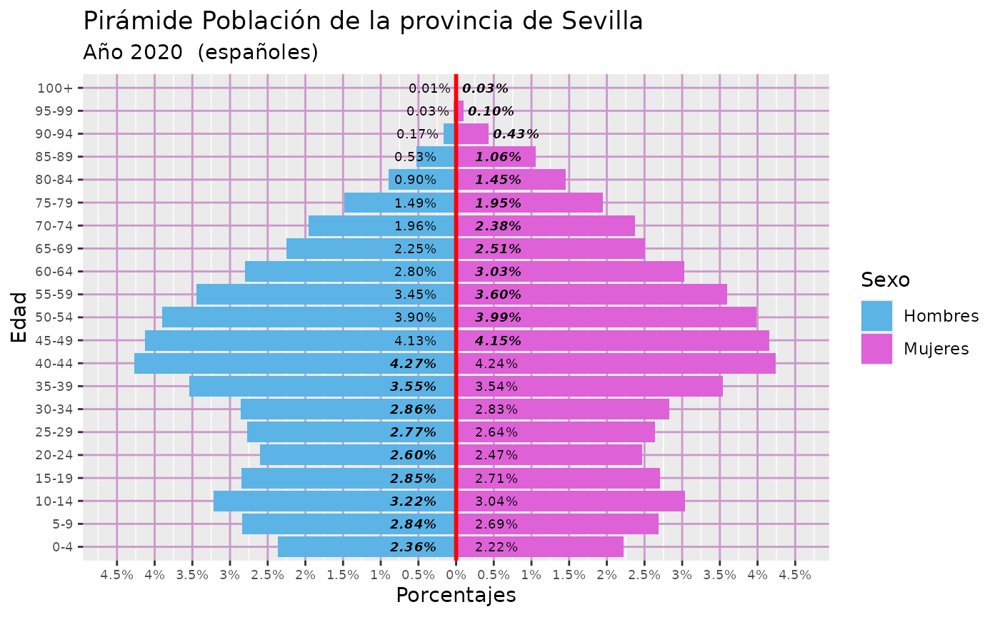

### Example of import px file

The function
[`DemBas_read_px()`](https://DemographyBasic.github.io/reference/DemBas_read_px.md)
is used to read px files. For example, to read the file 9663.px that is
located in the examples folder of the DemographyBasic package, you can
do:

``` r

dfej02a <- DemBas_read_px(system.file("examples/9663.px", package = "DemographyBasic"))
head(dfej02a)
#>               Periodo        Sexo Edad.simple    value
#> 1  1 de julio de 2018 Ambos sexos       Total 46733038
#> 2 1 de enero de  2018 Ambos sexos       Total 46658447
#> 3  1 de julio de 2017 Ambos sexos       Total 46532869
#> 4 1 de enero de  2017 Ambos sexos       Total 46527039
#> 5  1 de julio de 2016 Ambos sexos       Total 46449874
#> 6 1 de enero de  2016 Ambos sexos       Total 46440099
```

### Example of use of the function DemBas_anade_GEdad5

``` r

datos = DemBas_read_px(system.file("examples/9663.px", package = "DemographyBasic"))
datosPob = datos |>
  dplyr::filter(Periodo == "1 de enero de  2018",
                Edad.simple != "Total",
                Sexo != "Ambos sexos") |>
  dplyr::select(Sexo, Edad.simple, Poblacion = value)

datosPob2 = datosPob |>
  dplyr::mutate(
    Edad = as.numeric(gsub("[años|año]", "", Edad.simple)),
    Poblacion = round(Poblacion, 0)
  )
#> Warning: There was 1 warning in `dplyr::mutate()`.
#> ℹ In argument: `Edad = as.numeric(gsub("[años|año]", "", Edad.simple))`.
#> Caused by warning:
#> ! NAs introduced by coercion

datosPob2_conGruposEdad = DemBas_anade_GEdad5(datosPob2, Edad)
head(datosPob2_conGruposEdad,15)
#>       Sexo Edad.simple Poblacion Edad GEdad5 GEdad5Num
#> 1  Hombres      0 años    202087    0    0-4         0
#> 2  Mujeres      0 años    190476    0    0-4         0
#> 3  Hombres       1 año    213645    1    0-4         0
#> 4  Mujeres       1 año    202147    1    0-4         0
#> 5  Hombres      2 años    220675    2    0-4         0
#> 6  Mujeres      2 años    207897    2    0-4         0
#> 7  Hombres      3 años    225090    3    0-4         0
#> 8  Mujeres      3 años    211158    3    0-4         0
#> 9  Hombres      4 años    222904    4    0-4         0
#> 10 Mujeres      4 años    210149    4    0-4         0
#> 11 Hombres      5 años    236080    5    5-9         5
#> 12 Mujeres      5 años    221885    5    5-9         5
#> 13 Hombres      6 años    245458    6    5-9         5
#> 14 Mujeres      6 años    230456    6    5-9         5
#> 15 Hombres      7 años    247867    7    5-9         5


datosPirAgru = DemBas_anade_GEdad5(datosPob2, Edad) |>
  dplyr::select(Sexo, Edad, Poblacion, GEdad5) |>
  dplyr::group_by(GEdad5, Sexo) |>
  dplyr::summarise(Poblacion = sum(Poblacion), .groups = "keep")

head(datosPirAgru)
#> # A tibble: 6 × 3
#> # Groups:   GEdad5, Sexo [6]
#>   GEdad5   Sexo    Poblacion
#>   <chr>    <chr>       <dbl>
#> 1 "  0-4"  Hombres   1084401
#> 2 "  0-4"  Mujeres   1021827
#> 3 "  5-9"  Hombres   1250866
#> 4 "  5-9"  Mujeres   1173108
#> 5 " 10-14" Hombres   1261152
#> 6 " 10-14" Mujeres   1187212
```

### Example of pyramids with cohorts

``` r

load(file = system.file("examples/04003px.RData", package = "DemographyBasic"))
datosPiramide =  datos |>
  dplyr::filter(Ano == 2020 &
                  Sexo %in% c("Mujeres", "Hombres") &
                  Edad != "TOTAL" &
                  CCAA.Prov == "Sevilla" &
                  Espanoles.Extranjeros == "Españoles") |>
  dplyr::rename(Poblacion = value) |>
  dplyr::select(Edad, Sexo, Poblacion)

g_pir1 = DemBas_piramidePorc_Generaciones(datosPiramide,
                                          Gtitulo = "Pirámide Población de la provincia de Sevilla",
                                          Gsubtitulo = "Año 2020  (españoles)")
g_pir1
```

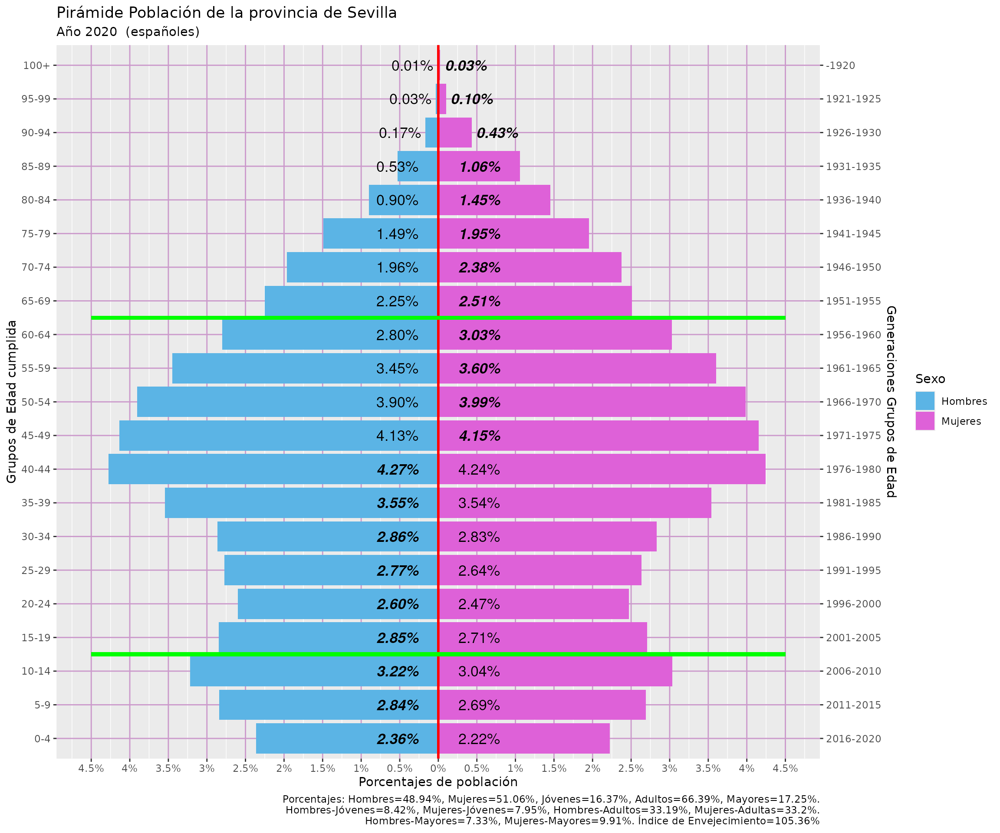

### Example of pyramids with segments

``` r

tp1 = dfej02a %>% 
  dplyr::filter(Periodo=="1 de enero de  2017",Edad.simple=="Total") %>%  
  # hay dos espacios entre "de" y "2017"
  dplyr::select("Sexo","value")

PV = round(tp1$value[tp1$Sexo=="Hombres"]/tp1$value[tp1$Sexo=="Ambos sexos"],
           4)*100
#### España a 1 de enero de 2017.

x1 = as.character(DemBas_extrae_codigo_provincia(dfej02a$Edad.simple))
x1n = as.numeric(x1)
#> Warning: NAs introduced by coercion

x1ngr = DemBas_agrupar_variable(x1n,metodo=2,final=100)

dfej02a$EdadGrupos = x1ngr

tp3 = dfej02a %>% 
  dplyr::filter( Periodo=="1 de enero de  2017", 
                 !(Edad.simple %in% c("100 y más años","Total"))) %>% 
  dplyr::group_by(Sexo,EdadGrupos) %>% 
  dplyr::summarise(Poblacion = round(sum(value,na.rm=T),0), .groups = "keep")


dfPir2017 = dfej02a %>% 
  dplyr::filter( Periodo=="1 de enero de  2017", 
                 !(Sexo=="Ambos sexos"),
                 !(Edad.simple %in% c("100 y más años","Total"))) %>% 
  dplyr::select(Edadchar=Edad.simple,
                Sexo,
                Poblacion = value)
dfPir2017$Edad = DemBas_extrae_codigo_provincia(dfPir2017$Edadchar)
dfPir2017$Edad = factor(dfPir2017$Edad,levels =unique(dfPir2017$Edad))
dfPir2017$Poblacion[is.na(dfPir2017$Poblacion)] = 0 
head(dfPir2017)
#>   Edadchar    Sexo Poblacion Edad
#> 1   0 años Hombres  210605.9    0
#> 2   0 años Mujeres  199294.2    0
#> 3    1 año Hombres  218041.9    1
#> 4    1 año Mujeres  205462.2    1
#> 5   2 años Hombres  223029.6    2
#> 6   2 años Mujeres  209112.7    2
```

``` r

DemBas_piramide_ggplot2(dfPir2017,
                      #etiquetas = T,etiquetas.size = 2,
                      etiq.hombre = "Hombres",etiq.mujer = "Mujeres") +
  labs(title = "Pirámide de Población de España en 2017") +
  scale_x_discrete(
    # si la variable edad fuera numeric debería usarse scale_x_continuous
    breaks = seq(0,105,by=5),
    labels = paste0(as.character(seq(0,105,by=5)), ""))  
```

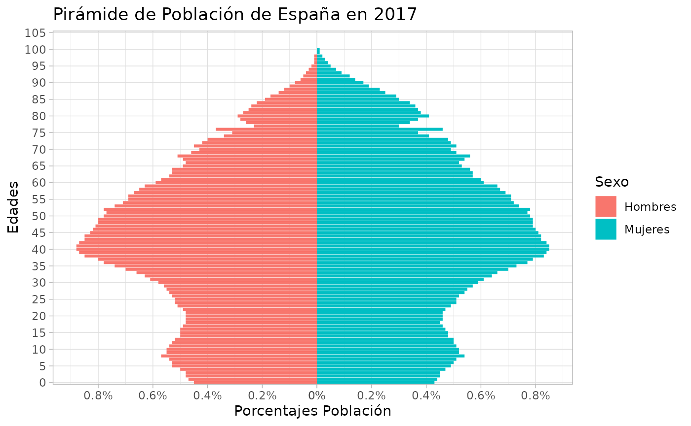

### Example of pyramids with segments and porcentages

``` r

DemBas_piramide_ggplot2_linea(dfPir2017,colorear = "Sexo",
                            etiq.hombre = "Hombres",etiq.mujer = "Mujeres") + 
  labs(title = "Perfil de la Pirámide de Población de España en 2017") +
  scale_x_discrete(
    # si la variable edad fuera numeric debería usarse scale_x_continuous
    breaks = seq(0,105,by=5),
    labels = paste0(as.character(seq(0,105,by=5)), "")) +
  guides(colour="none")
```

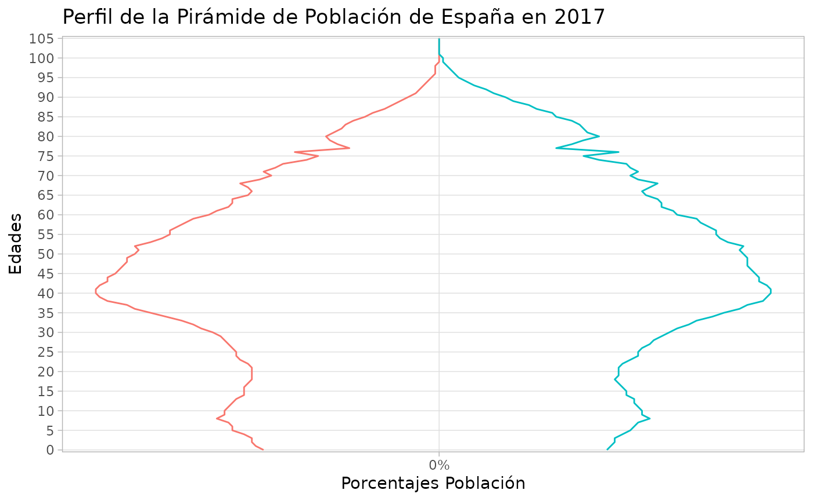

### Example of pyramids superimposed

``` r

dfPir2002 = dfej02a %>% 
  dplyr::filter( Periodo=="1 de enero de  2002", 
                 !(Sexo=="Ambos sexos"),
                 !(Edad.simple %in% c("100 y más años","Total"))) %>% 
  dplyr::select(Edadchar=Edad.simple,
                Sexo,
                Poblacion = value)
dfPir2002$Edad = DemBas_extrae_codigo_provincia(dfPir2002$Edadchar)
dfPir2002$Edad = factor(dfPir2002$Edad,levels =unique(dfPir2002$Edad))
dfPir2002$Poblacion[is.na(dfPir2002$Poblacion)] = 0
dfPir2002y2017 = rbind(dfPir2002,dfPir2017)
dfPir2002y2017$Caso = c(rep(2002,nrow(dfPir2002)),rep(2017,nrow(dfPir2017)))
head(dfPir2002y2017)
#>   Edadchar    Sexo Poblacion Edad Caso
#> 1   0 años Hombres  210646.4    0 2002
#> 2   0 años Mujeres  201046.8    0 2002
#> 3    1 año Hombres  204827.9    1 2002
#> 4    1 año Mujeres  193282.1    1 2002
#> 5   2 años Hombres  197158.7    2 2002
#> 6   2 años Mujeres  187579.5    2 2002
```

``` r

DemBas_piramide_superpuestas_ggplot2(dfPir2002y2017,
                                   etiq.hombre = "Hombres",etiq.mujer = "Mujeres",
                                   transparente = T) + 
  labs(title = "Pirámides de Población de España en 2002 y 2017 superpuestas") +
  scale_x_discrete(
    breaks = seq(0,105,by=5),
    labels = paste0(as.character(seq(0,105,by=5)), "")) 
#> Warning in geom_bar(data = subset(df2, Caso == UniCasos[i]), stat = "identity", : Ignoring unknown parameters: `size`
#> Ignoring unknown parameters: `size`
```

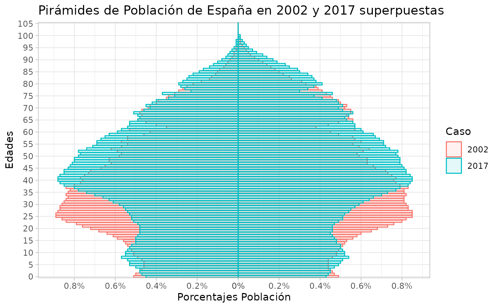

## Crear gráficos con ggplot2

En este apartado haremos una introducción muy básica a las capacidades
gráficas del paquete “**ggplot2**” que forma parte del **sistema
“tidyverse”** y es posiblemente el paquete R de **tratamiento gráfico
más usado en la actualidad**.

La idea que se usa en este paquete es añadir paso a paso las distintas
capas que constituirán el gráfico final:

1.  Especificar los datos (tibble o data.frame).
2.  Indicar las columnas que se van a utilizar y el papel que
    desempeñarán en el gráfico
    ([`aes()`](https://ggplot2.tidyverse.org/reference/aes.html)).
3.  Añadir el tipo o tipos de gráficos que se van a representar.
4.  Especificar las características particulares del gráfico, en
    particular las leyendas o texto explicativo que llevará.

Veremos a través de ejemplos cómo se construyen gráficos con el paquete
“ggplot2”, en concreto construiremos los siguientes tipos de gráficos:

- Diagramas de barras o columnas
- Diagramas de líneas

Se van a usar dos ficheros RData:

- `datos2_mej.RData`

- `DatosINE_PLC.RData`

``` r

load(system.file("examples/datos2_mej.RData", package = "DemographyBasic"))
load(system.file("examples/DatosINE_PLC.RData", package = "DemographyBasic"))
```

## Diagrama de barras o columnas

Utilizaremos el dataset: `datos2_mej` contenidos en `datos2_mej.RData`.

``` r

DemBas_presentadf(head(datos2_mej))
```

| Provincia           | CCAA                     |   TOTAL |  Varon |  Mujer |
|:--------------------|:-------------------------|--------:|-------:|-------:|
| 01-Álava            | País Vasco               |  286387 | 142036 | 144351 |
| 02-Albacete         | Castilla-La Mancha       |  364835 | 181461 | 183374 |
| 03-Alicante/Alacant | Comunidad Valenciana     | 1461925 | 722162 | 739763 |
| 04-Almería          | Andalucía                |  536731 | 272023 | 264708 |
| 33-Asturias         | Asturias (Principado de) | 1062998 | 508995 | 554003 |
| 05-Ávila            | Castilla y León          |  163442 |  81850 |  81592 |

### Ejemplo

En el siguiente código veremos como se construye un **diagrama de
columnas de la variable “Poblacion” de las comunidades autónomas (CCAA)
para el censo del 2001**.

En primer lugar, preparamos los datos que se van a necesitar con ayuda
del sistema tidyverse:

``` r

datos_CCAA = datos2_mej %>% 
  dplyr::group_by(CCAA) %>% 
  dplyr::summarise(TOTALCCAA = sum(TOTAL),
            TOTALVarón = sum(Varon),
            TOTALMujer = sum(Mujer)) %>% 
  dplyr::arrange(desc(TOTALCCAA))

datos_CCAA %>% 
  #glimpse()   # versión mejorada de la función str() en tidyverse
  head(10) %>%
  DemBas_presentadf()
```

| CCAA                  | TOTALCCAA | TOTALVarón | TOTALMujer |
|:----------------------|----------:|-----------:|-----------:|
| Andalucía             |   7357558 |    3622066 |    3735492 |
| Cataluña              |   6343110 |    3106531 |    3236579 |
| Madrid (Comunidad de) |   5423384 |    2609746 |    2813638 |
| Comunidad Valenciana  |   4162776 |    2046984 |    2115792 |
| Galicia               |   2695880 |    1294378 |    1401502 |
| Castilla y León       |   2456474 |    1209874 |    1246600 |
| País Vasco            |   2082587 |    1017881 |    1064706 |
| Castilla-La Mancha    |   1760516 |     875550 |     884966 |
| Canarias              |   1694477 |     842966 |     851511 |
| Aragón                |   1204215 |     594846 |     609369 |

Los pasos para la **construcción con “ggplot2”** del diagrama de barras
son:

1.  Usar la llamada a la función:
    [`ggplot()`](https://ggplot2.tidyverse.org/reference/ggplot.html)

    - con los datos que utilizaremos (en el ejemplo: `datos_CCAA`)
    - y la función
      [`aes()`](https://ggplot2.tidyverse.org/reference/aes.html), en la
      que se especifican quién irá al eje X e Y.

2.  Sumamos o añadimos la geometría de representación o el tipo de
    gráfico. En este caso:

    - \`geom_col()\`\`
    - y especificamos algunas características. Para este tipo de gráfico
      el color de las barras a través de “`fill`”.

3.  Y por último, usamos la función:
    [`labs()`](https://ggplot2.tidyverse.org/reference/labs.html), en la
    que indicaremos las distintas leyendas del gráfico.

Podemos verlo en el siguiente código R:

``` r

#library(ggplot2)
ggplot(datos_CCAA,aes(x=CCAA,y=TOTALCCAA)) + 
  geom_col(fill="blue") +
    labs(title="Población Española en 2001",
         subtitle="por Comunidades Autónomas",
       y="Población",x="Comunidades Autónomas",
       caption="Fuente: Elaboración propia") +
  scale_y_continuous(labels = scales::comma) +
  theme(axis.text.x = element_text(angle = 90, hjust = 1))  
```

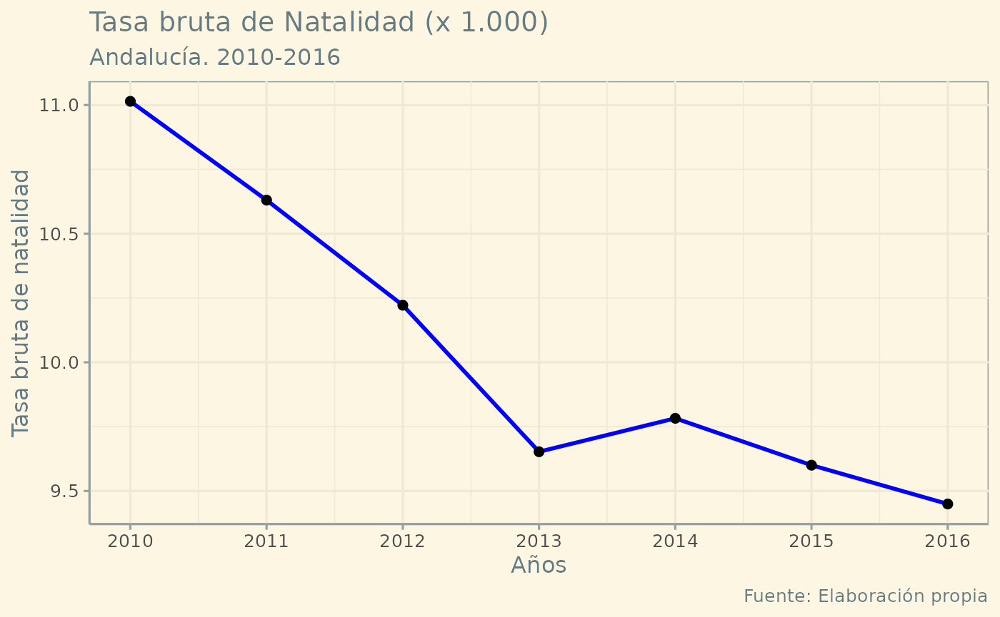

**Ejemplo**. Si queremos hacer la misma representación pero
intercambiando los ejes, añadiremos
[`coord_flip()`](https://ggplot2.tidyverse.org/reference/coord_flip.html).

En este gráfico además hemos modificado la forma de representar los
números de las etiquetas del eje en el que aparecen las cifras de
población.

``` r

ggplot(datos_CCAA,aes(x=CCAA,y=TOTALCCAA)) + 
  geom_col(fill="blue") +
    labs(title="Población Española en 2001",
         subtitle = "por Comunidades Autónomas",
       y="Población",x="Comunidades Autónomas",
       caption="Fuente: Elaboración propia") +
  scale_y_continuous(labels = scales::comma) +
  theme(axis.text.y = element_text(angle = 0, hjust = 1)) +  
  coord_flip()
```


#### Ordenar barras por orden descendente de valor

**Ejemplo**. Para presentar las columnas siguiendo algún tipo de orden
(por defecto, las ordena según el orden alfabético) se puede utilizar la
función [`reorder()`](https://rdrr.io/r/stats/reorder.factor.html).
Cuando se llama a
[`reorder()`](https://rdrr.io/r/stats/reorder.factor.html) el primer
argumento indica la columna que se usará para las etiquetas, y la
segunda columna será para indicar el orden en el que aparecerán (si se
quiere presentar en orden contrario se debe colocar un signo “-” delante
del segundo argumento).

``` r

ggplot(datos_CCAA,aes(x=reorder(CCAA,TOTALCCAA),y=TOTALCCAA)) + 
  geom_col(fill="blue") +
    labs(title="Población Española en 2001",
         subtitle = "por Comunidades Autónomas",
       y="Población",x="Comunidades Autónomas",
       caption="Fuente: Elaboración propia") +
  scale_y_continuous(labels = scales::comma) +
  theme(axis.text.y = element_text(angle = 0, hjust = 1)) +  
  coord_flip()
```

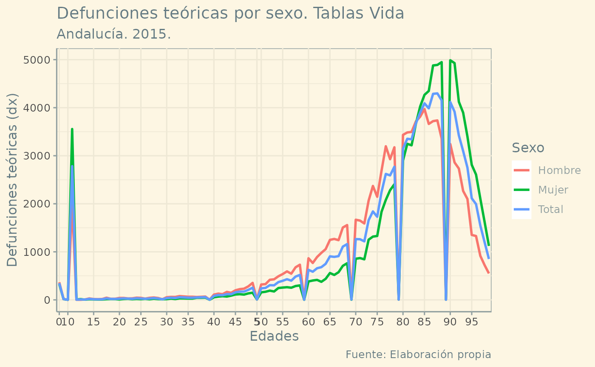

Esta representación nos permite identificar rápidamente la ordenación de
las comunidades autónomas según el número de habitantes.

### Diagrama de líneas

#### Ejemplo 1

Veamos ahora como representar un diagrama de líneas. El procedimiento es
prácticamente el mismo que el anterior, pero se cambiará la geometría o
tipo de gráfico, que en este caso es:
[`geom_line()`](https://ggplot2.tidyverse.org/reference/geom_path.html).

Vamos a construir un **diagrama de líneas con el que representaremos la
evolución de la tasa bruta de natalidad de 2010 a 2016**.

Manipulamos los datos que vamos a necesitar:

``` r

# library(dplyr)  # ya cargado al cargar DemographyBasic
Nac_And = Nacimientos_CCAA_EdadMadre_2010a2016 %>% 
  filter(Edades=="Todas las edades",CCAA=="Andalucía") %>% 
  select(Nacimientos)
Pob_And_ASexos = Poblacion_CCAA_TAnd_Edades_Sexo_2010a2017 %>% 
  filter(Sexo=="AmbosSexos",Codigo=="01",Edades=="TOTAL EDADES") %>%
  select(`2016`,`2015`,`2014`,`2013`,`2012`,`2011`,`2010`) %>% 
  as.numeric()
TBN_2016a2010 = DemBas_dem_TasaBruta_t(as.numeric(Nac_And[,1]),Pob_And_ASexos)
```

Nos quedamos con la información en el siguiente formato:

``` r

df.rep = data.frame(Año = 2016:2010,
                    TBN = TBN_2016a2010)
head(df.rep) |> 
  DemBas_presentadf()
```

|  Año |       TBN |
|-----:|----------:|
| 2016 |  9.449450 |
| 2015 |  9.600260 |
| 2014 |  9.782435 |
| 2013 |  9.652501 |
| 2012 | 10.221912 |
| 2011 | 10.630451 |

El código para el gráfico se recoge a continuación:

``` r

library(ggthemes)
ggplot(df.rep, aes(x = Año, y=TBN)) + 
  geom_line(alpha = 1,linetype = "solid", colour="blue",linewidth = 1) +
  geom_point(size = 2) +
  labs(title="Tasa bruta de Natalidad (x 1.000) ",
       subtitle = "Andalucía. 2010-2016",
       y="Tasa bruta de natalidad", 
       x="Años",
       caption="Fuente: Elaboración propia") +
  #scale_y_continuous(labels = scales::comma,breaks = seq(0,3.5,by=0.25)) +
  scale_x_continuous(breaks = seq(2010,2016,by=1)) + 
  theme(axis.text.y = element_text(angle = 0, hjust = 1)) + 
  theme_solarized()
```

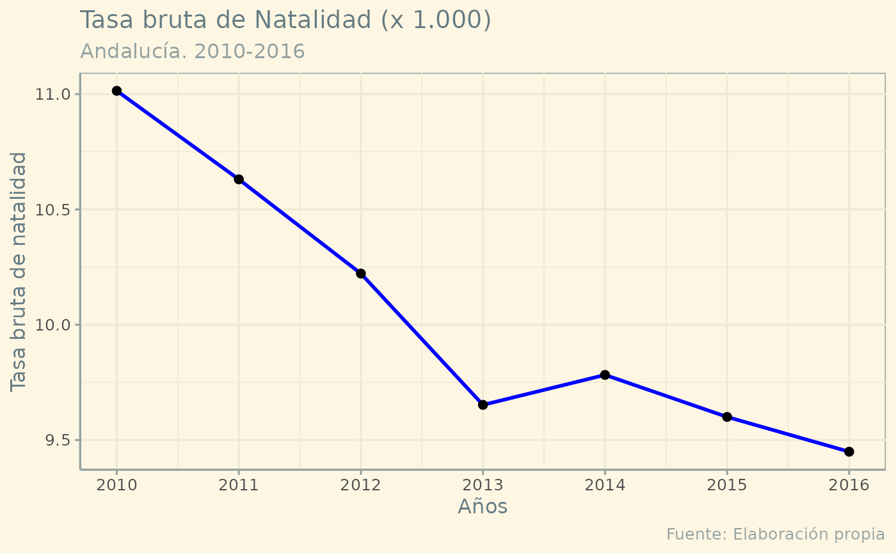

En este gráfico también hemos sumado la geometría
[`geom_point()`](https://ggplot2.tidyverse.org/reference/geom_point.html),
para añadir los puntos sobre el gráfico de líneas para resaltar sus
valores.

#### Ejemplo 2

En este nuevo ejemplo, representaremos las defunciones teóricas (función
$`dx`$ de la tabla de vida) en Andalucía en 2015, para edades simples,
distinguiendo según el sexo.

Los datos que se utilizarán por sexo son (para obtenerlos se han
realizado previamente otras manipulaciones de los datos con el sistema
tidyverse, ver @sec-apendicecodigo):

``` r

df.rep = data.frame(
  Edades = c(tmortalidad2015_AndAmb$Edad,
             tmortalidad2015_AndHom$Edad,
             tmortalidad2015_AndMuj$Edad),
  dx = c(tmortalidad2015_AndAmb$dx,
         tmortalidad2015_AndHom$dx,
         tmortalidad2015_AndMuj$dx),
  Sexo = c(rep("Total",nrow(tmortalidad2015_AndAmb)),
    rep("Hombre",nrow(tmortalidad2015_AndHom)),
           rep("Mujer",nrow(tmortalidad2015_AndMuj)))
)
df.rep |>  
  slice(1:6,102:104,203:205) |> 
  DemBas_presentadf()
```

| Edades |  dx | Sexo   |
|:-------|----:|:-------|
| 0      | 347 | Total  |
| 1      |  16 | Total  |
| 2      |  19 | Total  |
| 3      |  12 | Total  |
| 4      |   3 | Total  |
| 5      |   9 | Total  |
| 0      | 366 | Hombre |
| 1      |  17 | Hombre |
| 2      |  23 | Hombre |
| 0      | 328 | Mujer  |
| 1      |  15 | Mujer  |
| 2      |  15 | Mujer  |

En el argumento
[`aes()`](https://ggplot2.tidyverse.org/reference/aes.html) se ha
utilizado el papel “colour=Sexo”, para que se haga el diagrama de líneas
con un color distinto para cada modalidad de la variable “Sexo”. El
código para constuir el gráfico de líneas sería el siguiente:

``` r

ggplot(df.rep, aes(x = Edades, y=dx, group = Sexo, colour = Sexo))  + 
  geom_line(alpha = 1,
            linetype = "solid",
            linewidth = 1) +
  labs(title="Defunciones teóricas por sexo. Tablas Vida", 
       subtitle = "Andalucía. 2015.",
       y="Defunciones teóricas (dx)",
       x="Edades",
       caption="Fuente: Elaboración propia") +
  #scale_y_continuous(labels = scales::comma,breaks = seq(0,1,by=0.1)) +
  #scale_x_continuous(breaks = c(0,seq(5,100,by=5))) +
  scale_x_discrete(breaks = c(0,seq(5,100,by=5))) +
  theme(axis.text.y = element_text(angle = 0, hjust = 1)) +
  theme_solarized() 
```

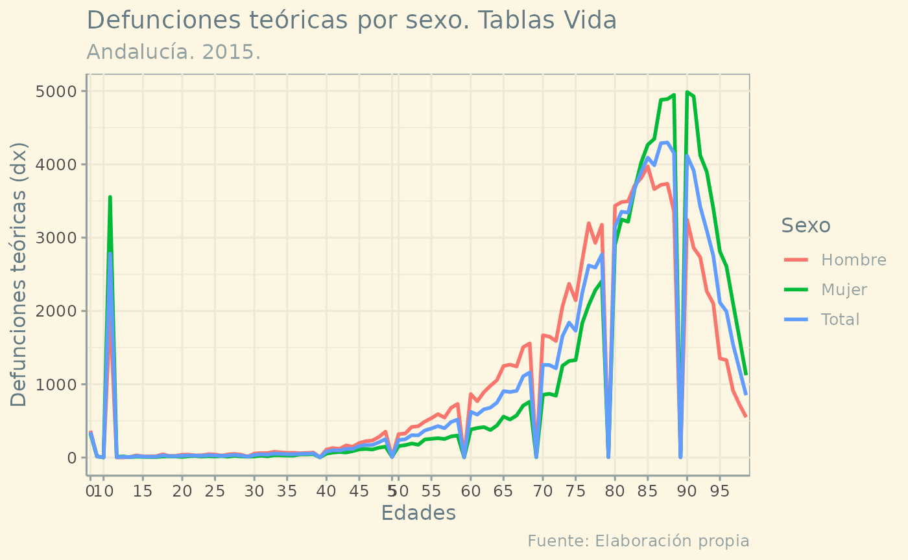

Se ha añadido la función
“[`theme_solarized()`](http://jrnold.github.io/ggthemes/reference/theme_solarized.md)”
que permite cambiar el aspecto general del gráfico (el tema “solarized”
fija un fondo amarillo y otras características). Existen otros muchos
tipos de temas predefinidos (consultar la ayuda de “ggplot2” y del
paquete “ggthemes”).

#### Código tidyverse utilizado para obtener los datos de este ejemplo

**Nota:** Aquí se ha utilizado un truco para mostrar código R escrito y
ejecutado-utilizado previamente en el fichero Quarto, y mostrarlo en un
punto posterior del fichero (como en un apéndice).

``` r


## Extraemos los datos necesarios de defunciones y poblaciones medias 
## para obtener las tasas específicas de mortalidad para Andalucía 
## para los años 2015 y 2016:

df_def01_15 = Defunciones_CCAA_Edades_Sexo_2015 %>% 
  filter(Codigo=="01") %>% 
  select(EdadesNum,`Ambos sexos`)
df_def01_15[101,2] = df_def01_15[101,2] + df_def01_15[102,2]
df_def01_15 = df_def01_15[-102,]
names(df_def01_15)[2] = "Defunciones"

df_pob01_T_15 = Poblacion_CCAA_Edades_Sexo_2015julio %>% 
  filter(CodigosCCAA=="01",Sexo=="AmbosSexos",!is.na(EdadesNum)) %>% 
  select(EdadesNum,Poblacion)


df_def01_16 = Defunciones_CCAA_Edades_Sexo_2016 %>% 
  filter(Codigo=="01") %>% 
  select(EdadesNum,`Ambos sexos`)
df_def01_16[101,2] = df_def01_16[101,2] + df_def01_16[102,2]
df_def01_16 = df_def01_16[-102,]
names(df_def01_16)[2] = "Defunciones"

df_pob01_T_16 = Poblacion_CCAA_Edades_Sexo_2016julio %>% 
  filter(CodigosCCAA=="01",Sexo=="AmbosSexos",!is.na(EdadesNum)) %>% 
  select(EdadesNum,Poblacion)

## tabla de mortalidad de edades simples para el **año 2015**:

mx_simples_15 = DemBas_mx(Px = df_pob01_T_15$Poblacion,
                                     Dx = df_def01_15$Defunciones,
                                     N0 = df_pob01_T_15$Poblacion[1],
                                     D0 = df_def01_15$Defunciones[1])
tmortalidad2015_AndAmb = DemBas_tablavida_completa(mx_simples_15)


## tabla de mortalidad de edades simples para el **año 2016**:

mx_simples_16 = DemBas_mx(Px = df_pob01_T_16$Poblacion,
                                     Dx = df_def01_16$Defunciones,
                                     N0 = df_pob01_T_16$Poblacion[1],
                                     D0 = df_def01_16$Defunciones[1])
tmortalidad2016_AndAmb = DemBas_tablavida_completa(mx_simples_16)


## Tablas de mortalidad de Hombres en Andalucía para 2016
## Extraemos los datos necesarios de defunciones y poblaciones medias 
## para obtener las tasas específicas de mortalidad para Andalucía 
## para los años 2015 y 2016:

df_def01h_15 = Defunciones_CCAA_Edades_Sexo_2015 %>% 
  filter(Codigo=="01") %>% 
  select(EdadesNum,Hombres)
df_def01h_15[101,2] = df_def01h_15[101,2] + df_def01h_15[102,2]
df_def01h_15 = df_def01h_15[-102,]
names(df_def01h_15)[2] = "Defunciones"

df_pob01_T_15 = Poblacion_CCAA_Edades_Sexo_2015julio %>% 
  filter(CodigosCCAA=="01",Sexo=="Hombres",!is.na(EdadesNum)) %>% 
  select(EdadesNum,Poblacion)

df_def01h_16 = Defunciones_CCAA_Edades_Sexo_2016 %>% 
  filter(Codigo=="01") %>% 
  select(EdadesNum,Hombres)
df_def01h_16[101,2] = df_def01h_16[101,2] + df_def01h_16[102,2]
df_def01h_16 = df_def01h_16[-102,]
names(df_def01h_16)[2] = "Defunciones"

df_pob01_T_16 = Poblacion_CCAA_Edades_Sexo_2016julio %>% 
  filter(CodigosCCAA=="01",Sexo=="Hombres",!is.na(EdadesNum)) %>% 
  select(EdadesNum,Poblacion)

## tabla de mortalidad de edades simples para el **año 2015**:

mx_simples_15 = DemBas_mx(Px = df_pob01_T_15$Poblacion,
                                     Dx = df_def01h_15$Defunciones,
                                     N0 = df_pob01_T_15$Poblacion[1],
                                     D0 = df_def01h_15$Defunciones[1])
tmortalidad2015_AndHom = DemBas_tablavida_completa(mx_simples_15)


## tabla de mortalidad de edades simples para el **año 2016**:

mx_simples_16 = DemBas_mx(Px = df_pob01_T_16$Poblacion,
                                     Dx = df_def01h_16$Defunciones,
                                     N0 = df_pob01_T_16$Poblacion[1],
                                     D0 = df_def01h_16$Defunciones[1])
tmortalidad2016_AndHom = DemBas_tablavida_completa(mx_simples_16)


## Tablas de mortalidad de Mujeres en Andalucía para 2016
## Extraemos los datos necesarios de defunciones y poblaciones medias para 
## obtener las tasas específicas de mortalidad para España:

df_def01m_15 = Defunciones_CCAA_Edades_Sexo_2015 %>% 
  filter(Codigo=="01") %>% 
  select(EdadesNum,Mujeres)
df_def01m_15[101,2] = df_def01m_15[101,2] + df_def01m_15[102,2]
df_def01m_15 = df_def01m_15[-102,]
names(df_def01m_15)[2] = "Defunciones"

df_pob01_T_15 = Poblacion_CCAA_Edades_Sexo_2015julio %>% 
  filter(CodigosCCAA=="01",Sexo=="Mujeres",!is.na(EdadesNum)) %>% 
  select(EdadesNum,Poblacion)

df_def01m_16 = Defunciones_CCAA_Edades_Sexo_2016 %>% 
  filter(Codigo=="01") %>% 
  select(EdadesNum,Mujeres)
df_def01m_16[101,2] = df_def01m_16[101,2] + df_def01m_16[102,2]
df_def01m_16 = df_def01m_16[-102,]
names(df_def01m_16)[2] = "Defunciones"

df_pob01_T_16 = Poblacion_CCAA_Edades_Sexo_2016julio %>% 
  filter(CodigosCCAA=="01",Sexo=="Mujeres",!is.na(EdadesNum)) %>% 
  select(EdadesNum,Poblacion)

## tabla de mortalidad de edades simples para el **año 2015**:
mx_simples_15 = DemBas_mx(Px = df_pob01_T_15$Poblacion,
                                     Dx = df_def01m_15$Defunciones,
                                     N0 = df_pob01_T_15$Poblacion[1],
                                     D0 = df_def01m_15$Defunciones[1])
tmortalidad2015_AndMuj = DemBas_tablavida_completa(mx_simples_15)


#- tabla de mortalidad de edades simples para el **año 2016**:

mx_simples_16 = DemBas_mx(Px = df_pob01_T_16$Poblacion,
                                     Dx = df_def01m_16$Defunciones,
                                     N0 = df_pob01_T_16$Poblacion[1],
                                     D0 = df_def01m_16$Defunciones[1])
tmortalidad2016_AndMuj = DemBas_tablavida_completa(mx_simples_16)
```

## Crear diagramas de Lexis

Para facilitar la elaboración de diagramas de Lexis en R se recomienda
el uso del paquete R: “**LexisPlotR**”. Este paquete se basa en el
paquete “**ggplot2**”, por tanto, podrían añadirse nuevas capas o
características, con todas las posibilidades que admite “ggplot2”.

Este paquete se puede instalar como cualquier otro paquete R. Una vez
instalado, podría usarse con tan solo cargarlo.

``` r

library(LexisPlotR)
```

Veamos algunos ejemplos de lo que se puede representar con este paquete
extraídas de la página en Github de este paquete. El código usado en los
siguientes ejemplos son autoexplicativos.

### Ejemplo: `lexis_grid()`

Con la función
[`lexis_grid()`](https://rdrr.io/pkg/LexisPlotR/man/lexis_grid.html) se
representa un diagrama de Lexis desde el año 2000 a 2005, representando
las edades desde 0 a 5.

``` r

#lexis.grid(year.start = 2000, year.end = 2005, age.start = 0, age.end = 5)
lexis_grid(year_start = 2000, year_end = 2005, 
           age_start = 0, age_end = 5)
#> Warning: The `size` argument of `element_line()` is deprecated as of ggplot2 3.4.0.
#> ℹ Please use the `linewidth` argument instead.
#> ℹ The deprecated feature was likely used in the LexisPlotR package.
#>   Please report the issue to the authors.
#> This warning is displayed once per session.
#> Call `lifecycle::last_lifecycle_warnings()` to see where this warning was
#> generated.
```

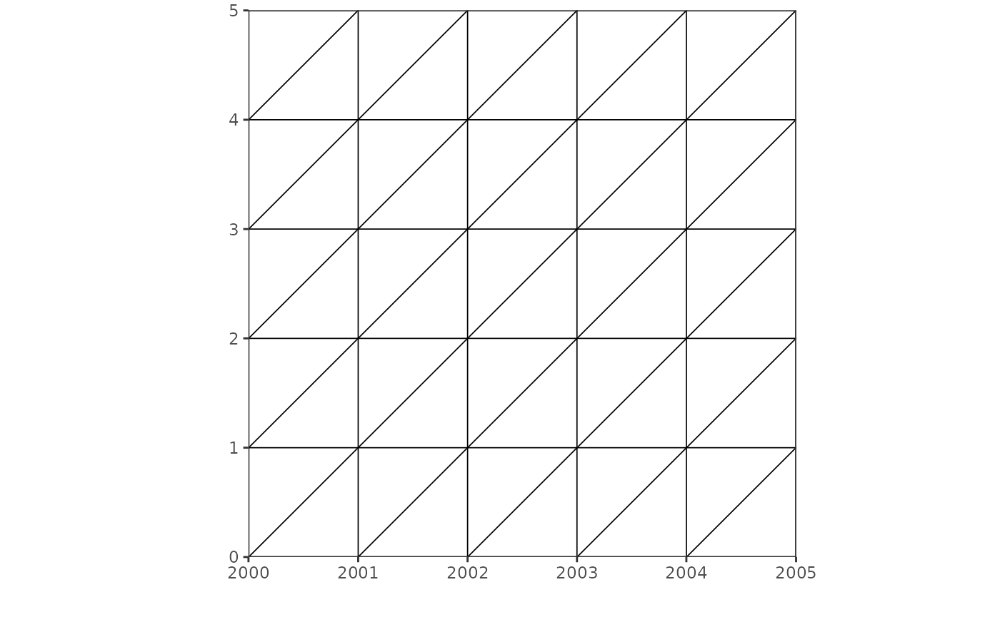

#### Ejemplo adicional

``` r

lexis_grid(year_start = 1900, year_end = 1950, age_start = 0, 
           age_end = 50, delta = 5)
```

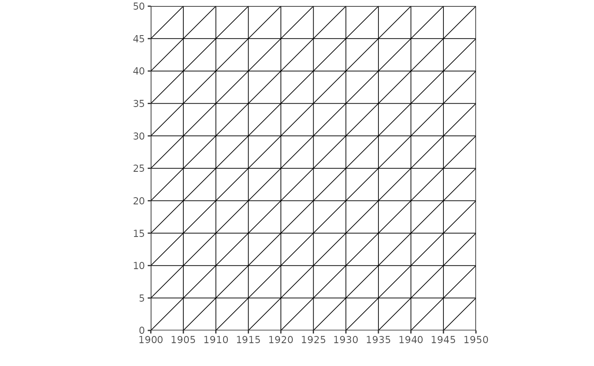

### Ejemplo: `lexis_age()`

``` r

lexis <- lexis_grid(year_start = 1900, year_end = 1905, 
                    age_start = 0, age_end = 5)
lexis_age(lg = lexis, age = 2)
```

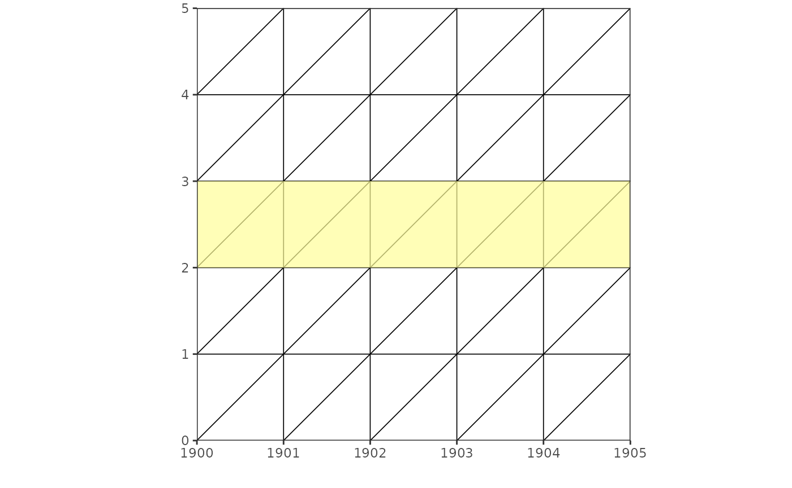

### Ejemplo: `lexis_year()`

``` r

lexis <- lexis_grid(year_start = 1900, year_end = 1905, 
                    age_start = 0, age_end = 5)
lexis_year(lg = lexis, year = 1903)
```

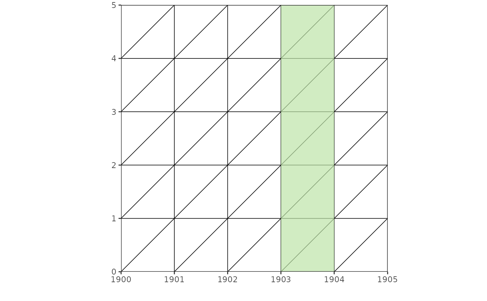

### Ejemplo: `lexis_cohort()`

``` r

lexis <- lexis_grid(year_start = 1900, year_end = 1905, 
                    age_start = 0, age_end = 5)
lexis_cohort(lg = lexis, cohort = 1898)
```

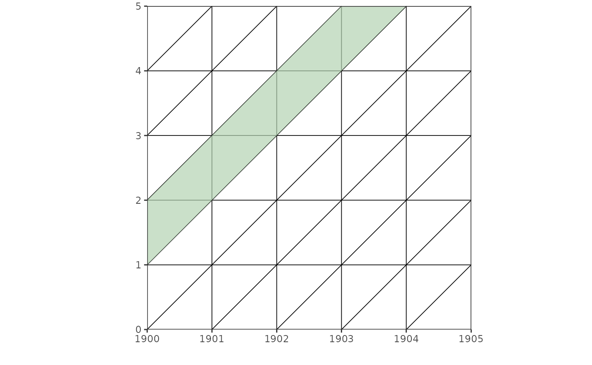

### Ejemplo: `lexis_polygon()`

``` r

lexis <- lexis_grid(year_start = 1900, year_end = 1905, 
                    age_start = 0, age_end = 5)

polygons <- data.frame(group = c(1, 1, 1, 2, 2, 2),
                       x = c("1901-01-01", "1902-01-01", 
                             "1902-01-01", "1903-01-01", 
                             "1904-01-01", "1904-01-01"),
                       y = c(1, 1, 2, 1, 1, 2))

lexis_polygon(lg = lexis, x = polygons$x, y = polygons$y, 
              group = polygons$group)
```

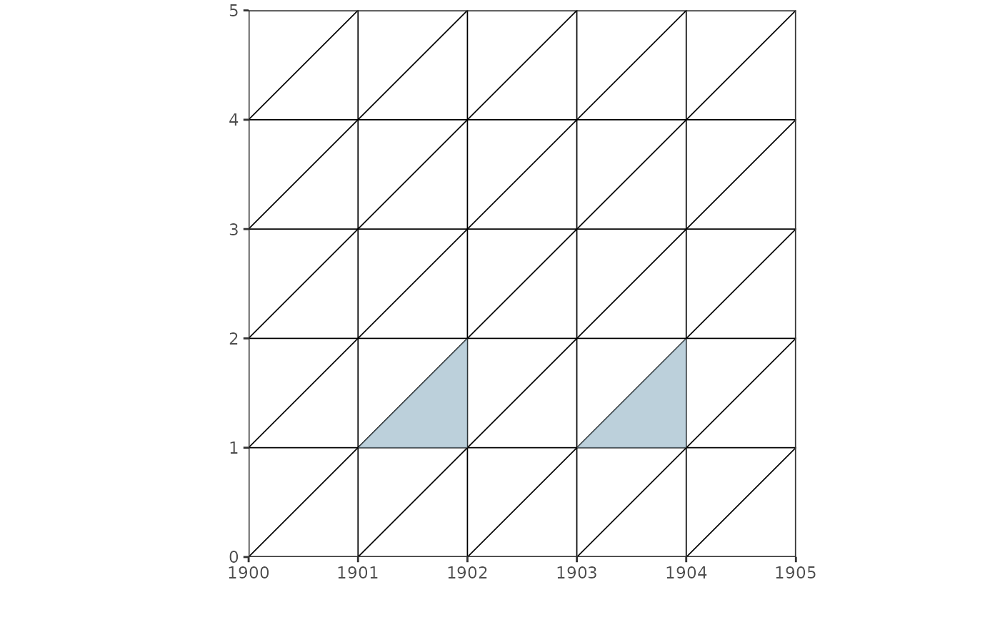

### Ejemplo: `lexis_lifeline()`

``` r

lg <- lexis_grid(year_start = 1900, year_end = 1905, age_start = 0, 
                 age_end = 5)
lexis_lifeline(lg = lg, birth = "1901-09-23", lwd = 1.5)
```

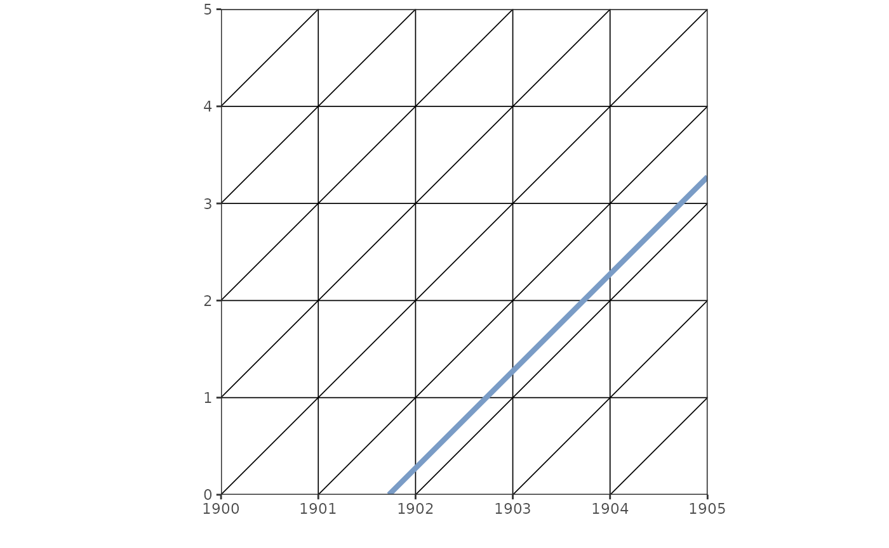

#### Ejemplo adicional 1

``` r

lexis_lifeline(lg = lg, birth = "1901-09-23", entry = "1902-04-01", 
               lwd = 1.5)
```

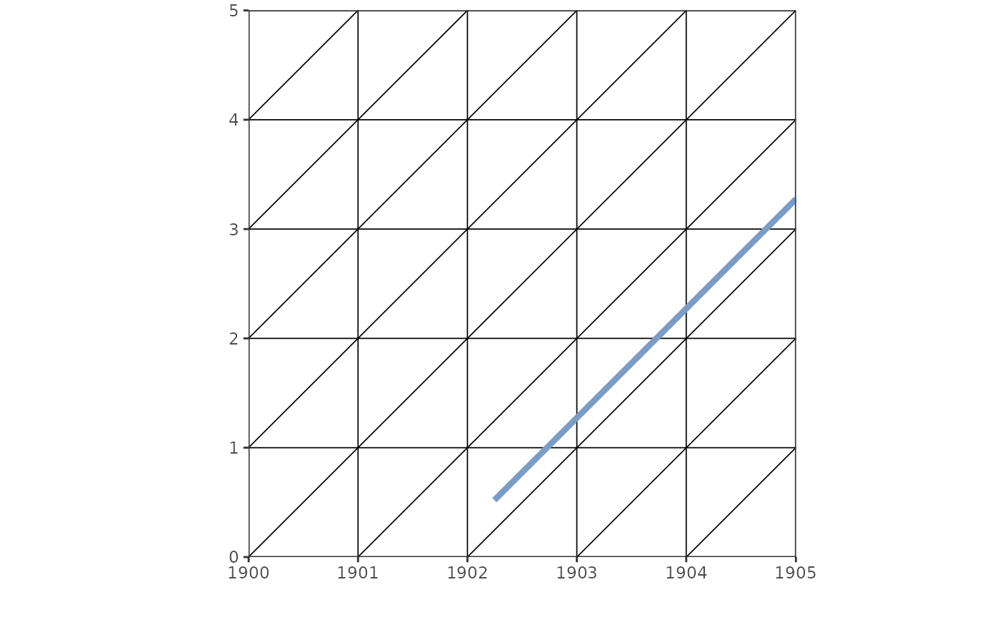

#### Ejemplo adicional 2

``` r

lexis_lifeline(lg = lg, birth = "1901-09-23", entry = "1902-04-01", 
               exit = "1904-10-31", lwd = 1.5)
```


### Ejemplo con operador “tubería”

Se puede utilizar con el operador de “tubería” del paquete “magrittr”
(incluido en tidyverse) y “sumar” elementos del paquete ggplot2.

``` r

library(ggplot2)

p <- lexis_grid(year_start = 1990, year_end = 2000, 
                age_start = 0, age_end = 10) %>%
  lexis_age(age = 3) %>%
  lexis_cohort(cohort = 1988) %>%
  lexis_year(year = 1998) %>%
  lexis_lifeline(birth = "1991-09-23", lwd = 1.5)

p <- p + labs(x = "Año", y = "Edad", "title" = "LexisPlotR")
p
```

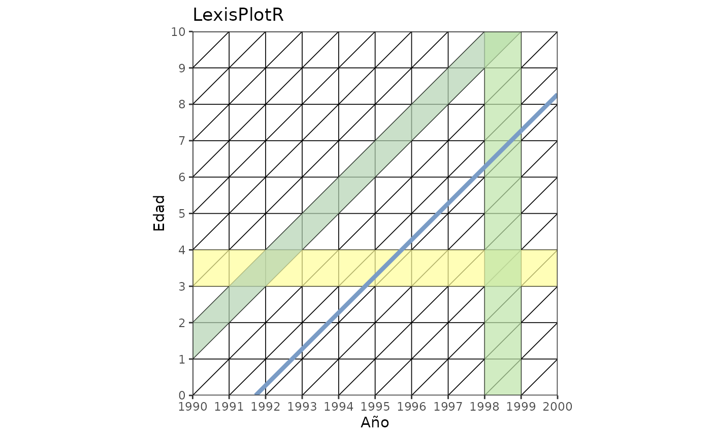

### Referencias

A continuación se facilitan algunos enlaces útiles sobre este paquete:

- [LexisPlotR en
  CRAN](https://cran.rstudio.com/web/packages/LexisPlotR/index.html)
- [LexisPlotR en Github](https://github.com/ottlngr/LexisPlotR)

## Instalación de mapSpain

Información obtenida:

- <https://ropenspain.github.io/mapSpain/>

Se recomienda utilizar la siguiente instrucción R para instalar el
paquete R: “mapSpain”.

``` r

install.packages("mapSpain", dependencies = TRUE)
```

El primer ejemplo que se mostrará se ha obtenido del modelo de partida
obtenido en la documentación de “mapSpain”:
<https://ropenspain.github.io/mapSpain/articles/x02_mapasesp.html>.

Cargamos los paquetes necesarios y utilizamos la función
[`esp_get_prov_siane()`](https://ropenspain.github.io/mapSpain/reference/esp_get_prov_siane.html)
para obtener información para la representación de mapas de tipo
provincial de España para unas determinadas provincias.

``` r

library(mapSpain)
library(ggplot2)
provs <- esp_get_prov(c(
  "Andalucía", "Ciudad Real",
  "Murcia", "Ceuta", "Melilla"
))
dplyr::glimpse(provs)
#> Rows: 12
#> Columns: 24
#> $ codauto           <chr> "01", "01", "01", "01", "01", "01", "01", "01", "08"…
#> $ cpro              <chr> "04", "11", "14", "18", "21", "23", "29", "41", "13"…
#> $ iso2.prov.code    <chr> "ES-AL", "ES-CA", "ES-CO", "ES-GR", "ES-H", "ES-J", …
#> $ nuts.prov.code    <chr> "ES611", "ES612", "ES613", "ES614", "ES615", "ES616"…
#> $ ine.prov.name     <chr> "Almería", "Cádiz", "Córdoba", "Granada", "Huelva", …
#> $ iso2.prov.name.es <chr> "Almería", "Cádiz", "Córdoba", "Granada", "Huelva", …
#> $ iso2.prov.name.ca <chr> NA, NA, NA, NA, NA, NA, NA, NA, NA, NA, NA, NA
#> $ iso2.prov.name.ga <chr> NA, NA, NA, NA, NA, NA, NA, NA, NA, NA, NA, NA
#> $ iso2.prov.name.eu <chr> NA, NA, NA, NA, NA, NA, NA, NA, NA, NA, NA, NA
#> $ cldr.prov.name.en <chr> "Almería", "Cádiz", "Córdoba", "Granada", "Huelva", …
#> $ cldr.prov.name.es <chr> "Provincia de Almería", "Provincia de Cádiz", "Provi…
#> $ cldr.prov.name.ca <chr> "Província d’Almeria", "Província de Cadis", "Provín…
#> $ cldr.prov.name.ga <chr> "Provincia de Almería", "Provincia de Cádiz", "Provi…
#> $ cldr.prov.name.eu <chr> "Almeríako probintzia", "Cádizko probintzia", "Kordo…
#> $ prov.shortname.en <chr> "Almería", "Cádiz", "Córdoba", "Granada", "Huelva", …
#> $ prov.shortname.es <chr> "Almería", "Cádiz", "Córdoba", "Granada", "Huelva", …
#> $ prov.shortname.ca <chr> "Almeria", "Cadis", "Còrdova", "Granada", "Huelva", …
#> $ prov.shortname.ga <chr> "Almería", "Cádiz", "Córdoba", "Granada", "Huelva", …
#> $ prov.shortname.eu <chr> "Almería", "Cádiz", "Kordoba", "Granada", "Huelva", …
#> $ nuts2.code        <chr> "ES61", "ES61", "ES61", "ES61", "ES61", "ES61", "ES6…
#> $ nuts2.name        <chr> "Andalucía", "Andalucía", "Andalucía", "Andalucía", …
#> $ nuts1.code        <chr> "ES6", "ES6", "ES6", "ES6", "ES6", "ES6", "ES6", "ES…
#> $ nuts1.name        <chr> "Sur", "Sur", "Sur", "Sur", "Sur", "Sur", "Sur", "Su…
#> $ geometry          <MULTIPOLYGON [°]> MULTIPOLYGON (((-2.186787 3..., MULTIPOLYGON (((-5.4…
```

A la geometría “ggplot2”
[`geom_sf()`](https://ggplot2.tidyverse.org/reference/ggsf.html), el
paquete “mapSpain”: facilita la información de la geometría (la coloca
en el elemento `geometry` del objeto R anterior: “`provs`”) necesaria
para representar mapas de España, que permitirá crear por ejemplo un
cartograma provincial con la metodología del paquete “ggplot2”. Se
colorea utilizando una función que genera colores:
[`hcl.colors()`](https://rdrr.io/r/grDevices/palettes.html).

``` r

ggplot(provs) +
  geom_sf(aes(fill = prov.shortname.es),
    alpha = 0.9
  ) +
  scale_fill_discrete(type = hcl.colors(12, "Cividis")) +
  theme_minimal() +
  labs(fill = "Provincias")
```

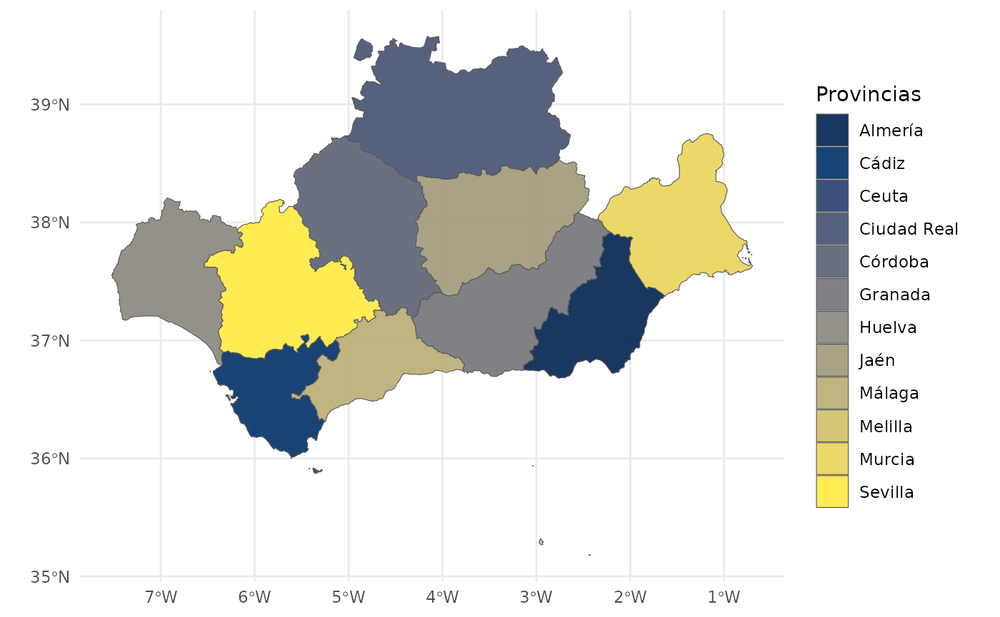

## Ejemplo 1: cartograma de provincias y provincias de comunidades autónomas

Se va a representar la información del “Saldo Migratorio Interno de
Andalucía”

``` r

#load("mapaejemplo01.RData")
load(system.file("examples/mapaejemplo01.RData", package = "DemographyBasic"))
df_a_mapa = data.frame(
  Codigo = DemBas_extrae_codigo_provincia(provs_filas),
  Valor = SMInternoAnd
)
df_a_mapa
#>            Codigo  Valor
#> 04 Almería     04  -1977
#> 11 Cádiz       11   3120
#> 14 Córdoba     14   7162
#> 18 Granada     18   1282
#> 21 Huelva      21   1900
#> 23 Jaén        23  10896
#> 29 Málaga      29 -19440
#> 41 Sevilla     41  -2943
```

En primer lugar obtenemos los datos necesarios con ayuda de tidyverse:

``` r

library(mapSpain)
library(dplyr)

provs = esp_get_prov(df_a_mapa$Codigo) |> # nombres provincias o codes
  left_join(df_a_mapa, by = c("cpro" = "Codigo"))
colnames(provs)
#>  [1] "codauto"           "cpro"              "iso2.prov.code"   
#>  [4] "nuts.prov.code"    "ine.prov.name"     "iso2.prov.name.es"
#>  [7] "iso2.prov.name.ca" "iso2.prov.name.ga" "iso2.prov.name.eu"
#> [10] "cldr.prov.name.en" "cldr.prov.name.es" "cldr.prov.name.ca"
#> [13] "cldr.prov.name.ga" "cldr.prov.name.eu" "prov.shortname.en"
#> [16] "prov.shortname.es" "prov.shortname.ca" "prov.shortname.ga"
#> [19] "prov.shortname.eu" "nuts2.code"        "nuts2.name"       
#> [22] "nuts1.code"        "nuts1.name"        "geometry"         
#> [25] "Valor"
```

El cartograma se obtendría con el siguiente código:

``` r

ggplot(provs) +
  #geom_sf(aes(fill = prov.shortname.es),
  geom_sf(aes(fill = Valor),
    alpha = 0.9
  ) +
  #scale_fill_discrete(type = hcl.colors(12, "Cividis")) +
  scale_fill_continuous(type = "viridis", direction = -1) +  # <1>
  # otros valores para "type": "gradient"
  #theme_minimal() +
  theme_void() +
  labs(fill = "Provincias",
       title = "Saldo Migratorio Interno (Andalucía 2010 a 2017)")
```

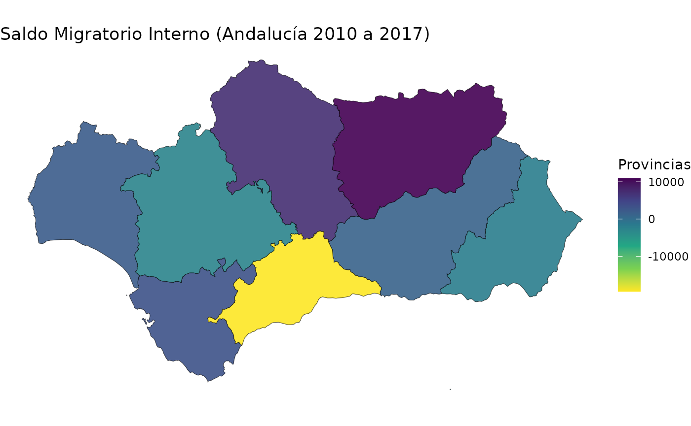

``` r

  #theme_void() +
  #theme(legend.position = c(0.1, 0.6))
```

1.  “`direction=-1`”: Si es “1”, valor por defecto, los colores son
    ordenados asociando valores pequeños al color más oscuro y los
    valores mayores al más claro. Si es “-1”, el orden de los colores es
    el inverso (es el que se ha seleccionado en este ejemplo), a mayor
    valor el color es más oscuro.

En este código se ha empleado por primera vez la miniherramienta del
paquete “dplyr”:
[`left_join()`](https://dplyr.tidyverse.org/reference/mutate-joins.html),
que nos permite combinar dos tablas relacionadas.

En este ejemplo, las dos tablas:

- `esp_get_prov_siane(df_a_mapa$Codigo)`
- `df_a_mapa`

relacionadas por los campos: “cpro” en la primera tabla y “Codigo” en la
segunda tabla.

## Ejemplo 2: cartograma con todas las provincias de España

Obtenemos los datos necesarios:

``` r

dfej02b = DemBas_read_px(system.file("examples/1489.px", package = "DemographyBasic"))
#> Warning in grepl("CHARSET.*ANSI", charset, ignore.case = T): unable to
#> translate 'SUBJECT-AREA="Indicadores de Estructura de la Poblaci<f3>n";' to a
#> wide string
#> Warning in grepl("CHARSET.*ANSI", charset, ignore.case = T): input string 4 is
#> invalid

head(dfej02b)
#>   Periodo     Provincias    value
#> 1    2018 Total Nacional 120.4598
#> 2    2017 Total Nacional 118.2625
#> 3    2016 Total Nacional 116.2798
#> 4    2015 Total Nacional 114.7221
#> 5    2014 Total Nacional 112.2386
#> 6    2013 Total Nacional 109.5282
tp4 = dfej02b %>% 
  dplyr::filter(Periodo=="2017", 
                Provincias!="Total Nacional")
  
df_a_mapa2 = data.frame(
  Codigo = DemBas_extrae_codigo_provincia(tp4$Provincias),
  Valor = tp4$value
)
head(df_a_mapa2)
#>                     Codigo     Valor
#> 02 Albacete             02 119.27793
#> 03 Alicante/Alacant     03 124.76932
#> 04 Almería              04  80.04999
#> 01 Araba/Álava          01 127.48705
#> 33 Asturias             33 209.95329
#> 05 Ávila                05 191.15470
```

Volvemos a combinar los datos con la información de los mapas que vamos
a representar:

``` r

provs = esp_get_prov(df_a_mapa2$Codigo) |> # nombres provincias o codes
  left_join(df_a_mapa2, by = c("cpro" = "Codigo"))
tmp = as.data.frame(provs[,c("prov.shortname.es","cpro","Valor")])
head(tmp[,1:3],10)
#>    prov.shortname.es cpro     Valor
#> 1            Almería   04  80.04999
#> 2              Cádiz   11  88.59844
#> 3            Córdoba   14 115.49199
#> 4            Granada   18 103.67738
#> 5             Huelva   21  94.33518
#> 6               Jaén   23 119.42942
#> 7             Málaga   29 100.31865
#> 8            Sevilla   41  87.30034
#> 9             Huesca   22 153.12134
#> 10            Teruel   44 175.22130
```

El cartograma de todas las provincias de España se obtiene con el
siguiente código:

``` r

ggplot(provs) +
  geom_sf(aes(fill = Valor),
    alpha = 0.9
  ) +
  scale_fill_continuous(type = "viridis", direction = -1) +  # "gradient"
  #theme_minimal() +
  theme_void() +
  labs(fill = "Provincias",
       title = "Índice de Envejecimiento provincial (España en 2017)")
```

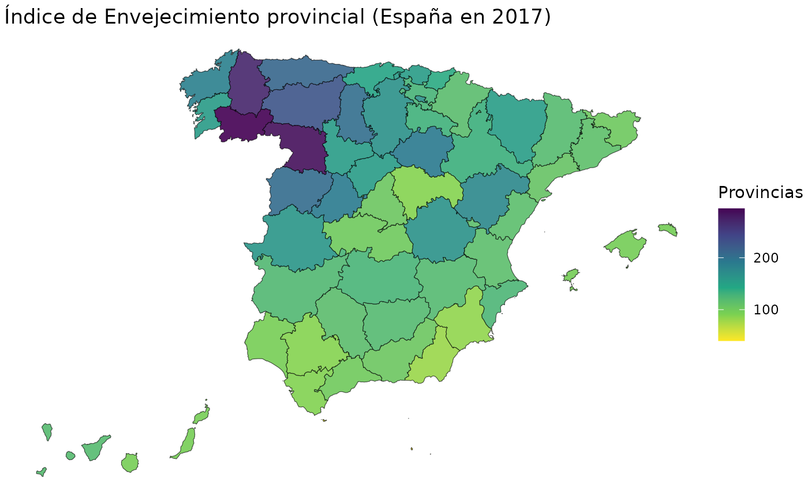

## Ejemplo 3: comunidades autónomas en España

Importamos y preparamos los datos que vamos a necesitar.

``` r

dfej02c = DemBas_read_px(system.file("examples/1452.px", package = "DemographyBasic"))
#> Warning in grepl("CHARSET.*ANSI", charset, ignore.case = T): unable to
#> translate 'SUBJECT-AREA="Indicadores de Estructura de la Poblaci<f3>n";' to a
#> wide string
#> Warning in grepl("CHARSET.*ANSI", charset, ignore.case = T): input string 4 is
#> invalid
head(dfej02c)
#>   Periodo Comunidades.y.Ciudades.Autónomas    value
#> 1    2018                   Total Nacional 120.4598
#> 2    2017                   Total Nacional 118.2625
#> 3    2016                   Total Nacional 116.2798
#> 4    2015                   Total Nacional 114.7221
#> 5    2014                   Total Nacional 112.2386
#> 6    2013                   Total Nacional 109.5282
```

Se usa el sistema tidyverse:

``` r

tp5 = dfej02c %>% 
  dplyr::filter(Periodo=="2017", 
                Comunidades.y.Ciudades.Autónomas!="Total Nacional")
  
df_a_mapa3 = data.frame(
  Codigo = DemBas_extrae_codigo_ccaa(tp5$Comunidades.y.Ciudades.Autónomas,
                                   ConvierteCodSIANE=FALSE),
  Valor = tp5$value
)
head(df_a_mapa3)
#>                            Codigo     Valor
#> 01 Andalucía                   01  96.21478
#> 02 Aragón                      02 140.25249
#> 03 Asturias, Principado de     03 209.95329
#> 04 Balears, Illes              04  95.99650
#> 05 Canarias                    05 105.73139
#> 06 Cantabria                   06 146.33787
```

Para construir un mapa sobre comunidades autónomas se ha seguido el
ejemplo de la [documentación de
mapaSapin](https://ropenspain.github.io/mapSpain/articles/x02_mapasesp.html):

``` r

ccaa <- esp_get_ccaa(ccaa = c(
  "Catalunya",
  "Comunidad Valenciana",
  "Aragón",
  "Baleares"
))  # se puede seleccionar un subconjunto de comunidades a representar

ccaa <- ccaa %>% mutate(
  ccaa_cat = esp_dict_translate(ccaa$ine.ccaa.name, "ca")
)

ggplot(ccaa) +
  geom_sf(aes(fill = ccaa_cat)) +
  labs(fill = "Comunitats autònomes") +
  theme_void() +
  scale_fill_discrete(type = hcl.colors(4, "Plasma"))
```

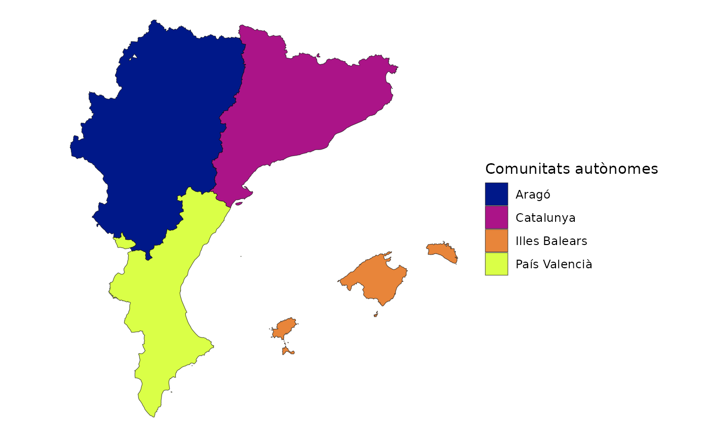

Ahora se representará el índice de envejecimiento para cada comunidad
autónoma en un cartograma:

``` r

ccaa <- esp_get_ccaa(ccaa = df_a_mapa3$Codigo) |> 
  left_join(df_a_mapa3, by = c("codauto" = "Codigo"))
tmp = as.data.frame(ccaa[,c("ccaa.shortname.es","codauto","Valor")])
head(tmp[,1:3],15)
#>       ccaa.shortname.es codauto     Valor
#> 1             Andalucía      01  96.21478
#> 2                Aragón      02 140.25249
#> 3              Asturias      03 209.95329
#> 4              Baleares      04  95.99650
#> 5              Canarias      05 105.73139
#> 6             Cantabria      06 146.33787
#> 7       Castilla y León      07 190.35820
#> 8    Castilla-La Mancha      08 113.82547
#> 9              Cataluña      09 111.86926
#> 10 Comunidad Valenciana      10 118.05022
#> 11          Extremadura      11 134.80844
#> 12              Galicia      12 192.50804
#> 13               Madrid      13 103.75784
#> 14               Murcia      14  83.37693
#> 15              Navarra      15 116.48976
```

El cartograma se construye con el siguiente código:

``` r

ggplot(ccaa) +
  geom_sf(aes(fill = Valor),alpha = 0.9,color = NA) +
  labs(fill = "Índice envejecimiento") +
  #theme_minimal() +
  theme_void() +
  labs(title = 
         "Índice de Envejecimiento (Comunidades Autónomas, España  2017)") +
  #scale_fill_continuous(type = "viridis", direction = -1)  # "gradient"
  scale_fill_gradientn(   # <1>
    colors = rev(hcl.colors(100, "Inferno")), # rev() para invertir la escala
    n.breaks = 10, #10,
    labels = scales::label_comma(),
    guide = guide_legend()
  )
```

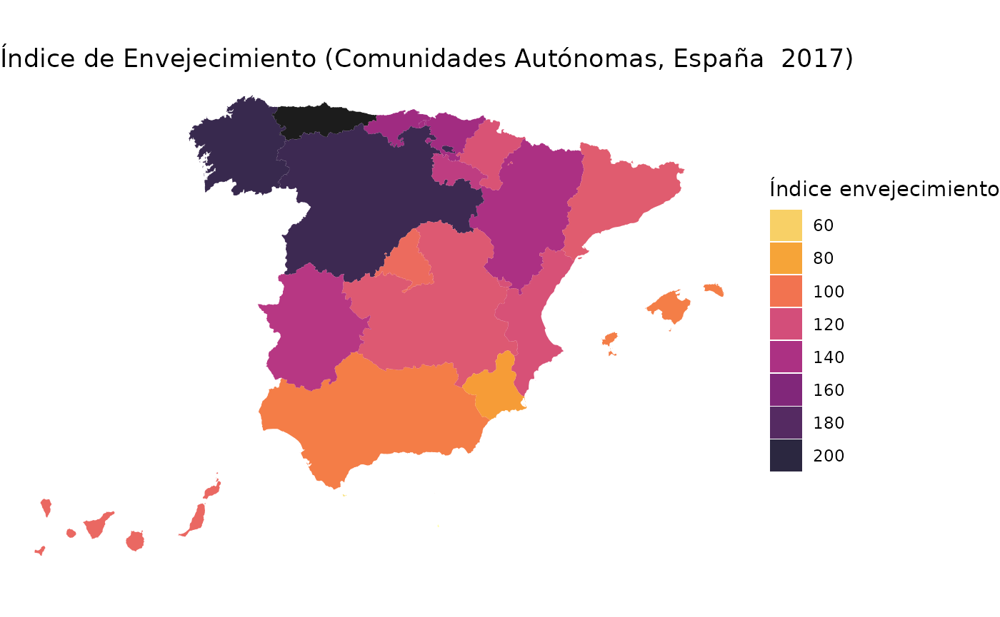

1.  [`scale_fill_gradientn()`](https://ggplot2.tidyverse.org/reference/scale_gradient.html).
    Ha permitido hacer una agrupación de colores en 10 grupos
    (`n.breaks = 10`), y para conseguir cambiar la dirección de los
    colores (valores pequeños son más claros y valores mayores son más
    oscuros) se ha usado la función
    [`rev()`](https://rdrr.io/r/base/rev.html) para invertir la
    presentación de los colores.

``` r

colores = c("#FFFE9E", "#FEF997", "#FDF491", "#FCF08A", "#FBEC84", 
            "#FBE77E", "#FAE378", "#FADF72", "#F9DB6C", "#F9D766", "#F9D360")
 # "#F9CE5A" "#F8CA54" "#F8C64F" "#F8C249" "#F8BE44" "#F8BA3F" "#F8B63A" 
 # "#F7B135" "#F7AD31" "#F7A92C" "#F7A529"
```

## Ejemplo 4: cartograma de municipios de provincias

Cartograma de la población de los municipios de Segovia en 2019 según el
INE:

``` r

load(system.file("examples/pobmum19.RData", package = "DemographyBasic"))
munic <- esp_get_munic(region = "Segovia") %>%  
  # Datos de ejemplo: Población INE
  left_join(pobmum19, by = c("cpro", "cmun"))
#> ! The file to be downloaded has size 74.6 Mb.
tmp = as.data.frame(munic[,c("name.x","cpro","pob19")])
head(tmp[,1:3],10)
#>                         name.x cpro pob19
#> 1                       Abades   40   848
#> 2              Adrada de Pirón   40    39
#> 3                      Adrados   40   126
#> 4                 Aguilafuente   40   573
#> 5        Alconada de Maderuelo   40    25
#> 6                  Aldealcorvo   40    22
#> 7       Aldealengua de Pedraza   40    72
#> 8   Aldealengua de Santa María   40    63
#> 9  Aldeanueva de la Serrezuela   40    44
#> 10      Aldeanueva del Codonal   40   117
```

El cartograma se construye con el siguiente código:

``` r

ggplot(munic) +
  geom_sf(aes(fill = pob19), alpha = 0.9, color = NA) +
  scale_fill_gradientn(
    colors = rev(hcl.colors(100, "viridis")),  # rev() para invertir la escala
    # otras plantillas de colores: "Inferno", "viridis", ...
    n.breaks = 10,
    labels = scales::label_comma(),
    guide = guide_legend()
  ) +
  labs(
    fill = "Habitantes",
    title = "Población en Segovia",
    subtitle = "Datos INE (2019)"
  ) +
  theme_void() +
  theme(
    plot.background = element_rect("grey80"),
    text = element_text(face = "bold"),
    plot.title = element_text(hjust = .5),
    plot.subtitle = element_text(hjust = .5)
  )
```

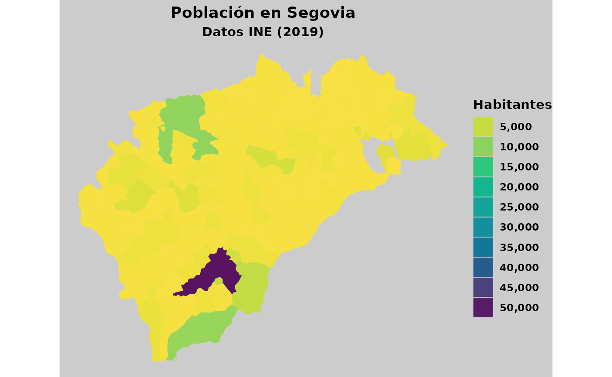

## Enlaces a las fuentes demográficas utilizadas

- [INEBASE-Demografía y Población-Fenómenos
  demográficos](http://www.ine.es/dyngs/INEbase/es/categoria.htm?c=Estadistica_P&cid=1254735573002)

- [Movimiento Natural de Población:
  Nacimientos](http://www.ine.es/dyngs/INEbase/es/operacion.htm?c=Estadistica_C&cid=1254736177007&menu=resultados&secc=1254736195442&idp=1254735573002)

  - Ver enlace: [Paso final MNP
    Nacimientos](http://www.ine.es/jaxiT3/Tabla.htm?t=6506&L=0)
